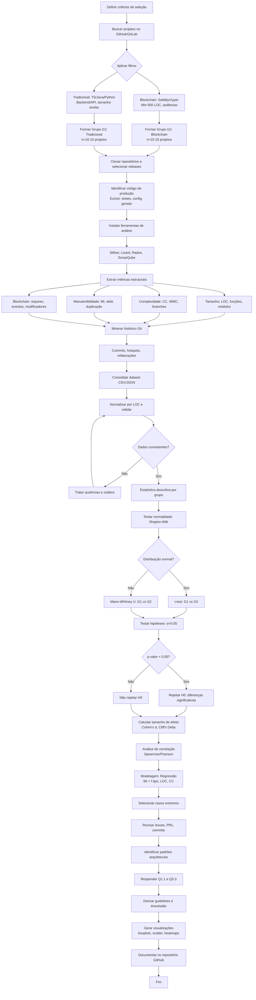

# Plano de Experimento – Scoping e Planejamento  
## **Comparação de Métricas de Qualidade entre Software Tradicional e Software Baseado em Blockchain: Um Estudo Empírico**

---

## 1. Identificação Básica

### 1.1 Título do Experimento  
**Comparação de Métricas de Qualidade entre Software Tradicional e Software Baseado em Blockchain: Um Estudo Empírico**

### 1.2 ID / Código  
**ES-BC-QUAL-2025-01**

### 1.3 Versão do Documento e Histórico de Revisão  
- **1.0 — 23/11/2025:** Versão inicial do plano de experimento, contendo escopo, objetivos, hipóteses, variáveis e metodologia proposta.  
*(Novas versões serão adicionadas conforme o andamento da coleta, análise e ajustes metodológicos.)*

### 1.4 Datas  
- **Data de criação:** 23 de novembro de 2025  
- **Última atualização:** 23 de novembro de 2025  
- **Período estimado de execução:** Novembro a Dezembro de 2025  
- **Responsável pelas atualizações:** Gabriel Pongelupe

### 1.5 Autores  
**Gabriel Pongelupe – Engenharia de Software**  
Responsável pela elaboração do documento, definição metodológica, execução da coleta e síntese dos resultados.  


### 1.6 Responsável Principal (PI – Principal Investigator)  
**Gabriel Pongelupe**, atuando como pesquisador principal deste estudo.  
Responsabilidades:  
- definição das questões de pesquisa;  
- elaboração das hipóteses e planejamento experimental;  
- seleção e preparação dos artefatos;  
- execução dos processos de coleta e normalização;  
- aplicação das técnicas estatísticas;  
- interpretação dos resultados e construção da conclusão final.

### 1.7 Projeto / Iniciativa Relacionada  
Este experimento integra as atividades da disciplina **Medição e Experimentação em Engenharia de Software**, cujo objetivo é aplicar rigor científico para investigar impactos de decisões de projeto e arquitetura em sistemas reais.  

O estudo se relaciona com temas contemporâneos como:  
- avaliação de qualidade em diferentes paradigmas de desenvolvimento;  
- impacto da descentralização, imutabilidade e custos de execução em métricas objetivas de software;  
- comparação empírica entre smart contracts e módulos tradicionais;  
- evolução das práticas de engenharia no ecossistema blockchain;  
- identificação de padrões arquiteturais decorrentes de restrições próprias de ambientes EVM e similares.

Trata-se de uma iniciativa voltada a compreender, com base em evidências, como o paradigma blockchain influencia atributos essenciais de qualidade que afetam manutenção, complexidade e custo de evolução.

---

## 2. Contexto e Problema

### 2.1 Descrição do Problema / Oportunidade  
A crescente adoção de tecnologias blockchain introduziu um novo paradigma de desenvolvimento de software, caracterizado por descentralização, execução determinística, imutabilidade do código implantado, e custos explícitos de processamento (gas) em ambientes como a Ethereum Virtual Machine (EVM). Embora esses fatores sejam fundamentais para garantir segurança e confiabilidade, eles impõem restrições arquiteturais e de design que podem alterar profundamente propriedades estruturais do software.

Enquanto sistemas tradicionais evoluem com maior flexibilidade – permitindo refatorações, atualizações incrementais e mudanças de arquitetura ao longo do tempo –, sistemas baseados em blockchain lidam com limitações práticas como:

- **Impossibilidade ou alto custo de atualizar smart contracts após o deploy**;  
- **Penalidade financeira associada à complexidade e ao tamanho do código (gas)**;  
- **Necessidade de minimizar superfícies de ataque**;  
- **Ambiente de execução altamente restrito, com limitações de estado, loops e armazenamento**.

Em consequência, surge uma oportunidade de pesquisa: **compreender, de maneira empírica e mensurável, como essas características afetam atributos clássicos de qualidade**, como complexidade, manutenibilidade, tamanho do código e modularidade.

Esse estudo busca preencher uma lacuna importante: embora existam trabalhos sobre verificação de segurança em smart contracts, **há pouca investigação empírica comparando diretamente métricas de software tradicionais com métricas de software blockchain**, o que é fundamental para entender o impacto real desse novo paradigma sobre o desenvolvimento e evolução de sistemas.

---

### 2.2 Relevância Técnica, Científica e Industrial  
A relevância deste experimento se manifesta em múltiplas esferas:

#### **Para engenheiros de software e desenvolvedores de smart contracts**  
O estudo pode orientar decisões práticas sobre design, modularização, complexidade desejável e estratégias de manutenção, especialmente em ambientes onde erros podem resultar em perdas financeiras irreversíveis.

#### **Para equipes de auditoria, segurança e qualidade**  
Auditores lidam diariamente com a necessidade de compreender estruturas de smart contracts e avaliar riscos; métricas comparativas podem oferecer indicadores objetivos para priorizar pontos críticos.

#### **Para a comunidade acadêmica**  
Blockchain representa um novo tipo de artefato de software, com restrições distintas das estudadas em modelos tradicionais. Entender como essas restrições influenciam métricas pode abrir novas linhas de pesquisa sobre qualidade, evolução, arquiteturas distribuídas e engenharia empírica.

#### **Para indústrias que dependem de contratos inteligentes**  
Setores como finanças descentralizadas (DeFi), rastreabilidade, logística, identidade digital e governança distribuída necessitam de maior previsibilidade, escalabilidade e segurança. Evidências sobre complexidade e manutenibilidade podem influenciar:

- custos de desenvolvimento;  
- esforço de manutenção;  
- riscos operacionais;  
- viabilidade de novos produtos baseados em blockchain.

---

### 2.3 Contexto Tecnológico e de Engenharia  
O experimento é conduzido com base em **projetos open-source** disponibilizados em plataformas como GitHub e GitLab, incluindo:

- smart contracts escritos em **Solidity** ou **Vyper**;  
- aplicações tradicionais em linguagens amplamente usadas (como TypeScript, Java, Python, Go).

Esses repositórios oferecem dados relevantes, como:

- histórico completo de commits;  
- racional de decisões arquiteturais em issues e pull requests;  
- auditorias, testes, padrões de design e práticas adotadas;  
- presença de ferramentas de análise estática e CI/CD.

Esse ambiente funciona como um **laboratório natural** para observar como diferentes paradigmas influenciam características objetivas de software, permitindo comparações quantitativas e qualitativas entre:

- sistemas descentralizados;  
- sistemas tradicionais monolíticos ou distribuídos;  
- diferentes estilos de modularidade;  
- diferentes impactos de restrições ambientais.

---

### 2.4 Trabalhos e Evidências Prévias  
Embora existam numerosos estudos sobre segurança em blockchain, a área de **métricas de qualidade aplicada a smart contracts** ainda é emergente. Alguns referenciais incluem:

- **Chen et al.** — análise de vulnerabilidades e padrões de desenvolvimento em smart contracts.  
- **Luu et al. (Oyente)** — identificação de padrões de execução e armadilhas relacionadas a complexidade.  
- **Kalra et al. (ZEUS)** — verificação formal e propriedades estruturais de contratos.  
- Estudos clássicos sobre métricas tradicionais:  
  - Chidamber & Kemerer (CK Metrics, 1994);  
  - Basili et al., complexidade e manutenibilidade;  
  - Pressman, Sommerville e a literatura base de Engenharia de Software.

Apesar desses trabalhos, **faltam estudos comparativos diretos entre sistemas blockchain e sistemas tradicionais utilizando as mesmas métricas de qualidade**, o que reforça a importância deste experimento.

---

### 2.5 Referencial Teórico e Empírico Essencial  
O experimento se fundamenta em uma combinação de literatura clássica e nova teoria emergente:

#### **Métricas de Engenharia de Software**
Baseia-se em modelos consagrados para medir complexidade, tamanho e manutenibilidade, como:

- Complexidade ciclomática (McCabe)
- Maintainability Index  
- LOC (Lines of Code)  
- Profundidade de aninhamento  
- Coesão e acoplamento (CK Metrics)

#### **Princípios de Design de Software**
Aplicados para contextualizar o impacto das restrições de blockchain:

- modularidade e encapsulamento;  
- minimização da complexidade;  
- princípio KISS (Keep It Simple, Stupid), amplamente adotado em smart contracts;  
- limitação de abstrações complexas devido ao custo de gas;  
- importância da previsibilidade e determinismo.

#### **Particularidades de Smart Contracts**
Incluem:

- execução em ambiente EVM;  
- custo por instrução computacional;  
- imutabilidade do código após o deploy;  
- padrões como “proxy pattern” para contornar limitações de atualização;  
- necessidade de minimizar superfícies de ataque e pontos de falha.

Esses elementos funcionam como lentes analíticas para interpretar resultados do experimento, permitindo discutir não apenas *o que* as métricas indicam, mas *por que* elas se comportam de forma distinta entre os dois paradigmas.

---
# 3. Objetivos e Questões (Goal / Question / Metric – GQM)

## 3.1 Objetivo geral (formulado no template GQM)
O objetivo geral deste estudo, seguindo o paradigma GQM, é **analisar diferenças estruturais e de qualidade entre projetos tradicionais e projetos baseados em blockchain**, com o propósito de **avaliar impactos mensuráveis da arquitetura blockchain (descentralização, custo de execução, imutabilidade, gas) em atributos de qualidade do código**, considerando métricas como complexidade, tamanho, modularidade e manutenibilidade.

A análise será conduzida sob a perspectiva de **pesquisadores, engenheiros de software e equipes de desenvolvimento que buscam compreender como tecnologias distribuídas influenciam a evolução, manutenção e qualidade do software**, no contexto de **projetos reais de código aberto escritos em linguagens típicas de desenvolvimento blockchain (Solidity, Rust/Substrate, Move) comparados a projetos tradicionais equivalentes**.

---

## 3.2 Objetivos específicos

**O1 – Caracterizar diferenças estruturais entre software tradicional e software blockchain**  
Identificar padrões estruturais e organizacionais que distinguem sistemas blockchain de sistemas tradicionais, incluindo tamanho, complexidade, modularização e dependências internas.

**O2 – Avaliar impacto das restrições do ambiente blockchain nas métricas de qualidade**  
Examinar como características como gas, imutabilidade, validações explícitas e custos de execução afetam medidas de complexidade, ramificações, lógica defensiva e redundância de código.

**O3 – Investigar correlação entre tipo de projeto e manutenibilidade**  
Avaliar se projetos blockchain apresentam menor índice de manutenibilidade, maior acoplamento ou maior necessidade de refatorações quando comparados a sistemas tradicionais.

**O4 – Analisar a evolução histórica dos projetos**  
Examinar diferenças no ritmo de evolução, quantidade de mudanças estruturais e incidência de refatorações profundas entre projetos blockchain e tradicionais.

**O5 – Derivar recomendações práticas para engenharia de software blockchain**  
Com base nas evidências empíricas, propor diretrizes para reduzir complexidade, melhorar manutenibilidade e apoiar decisões arquiteturais em sistemas blockchain.

---

## 3.3 Questões de pesquisa

### **O1 – Caracterizar diferenças estruturais**
- **Q1.1:** Projetos blockchain apresentam maior complexidade média de métodos/funções do que projetos tradicionais?  
- **Q1.2:** A modularização de contratos inteligentes difere significativamente da modularização de sistemas tradicionais?  
- **Q1.3:** O volume geral de código (LOC, arquivos, módulos) apresenta variações relevantes entre os dois grupos?

---

### **O2 – Impacto das restrições blockchain nas métricas**
- **Q2.1:** A existência de custos de execução (gas) aumenta o número de verificações, condicionais e lógica defensiva?  
- **Q2.2:** Smart contracts possuem maior complexidade ciclomática e profundidade de chamadas?  
- **Q2.3:** A imutabilidade gera maior repetição de lógica ou duplicação “controlada” em projetos blockchain?

---

### **O3 – Correlação entre tipo de projeto e manutenibilidade**
- **Q3.1:** A manutenibilidade medida por índices clássicos tende a ser menor em sistemas blockchain?  
- **Q3.2:** Módulos críticos em blockchain exigem maior esforço para modificação devido a dependências funcionais?  
- **Q3.3:** Há maior concentração de hotspots de manutenção em smart contracts?

---

### **O4 – Evolução histórica**
- **Q4.1:** Projetos blockchain apresentam menor frequência de modificações devido à imutabilidade?  
- **Q4.2:** Smart contracts requerem reescritas completas mais frequentemente do que sistemas tradicionais?  
- **Q4.3:** Atualizações de segurança tendem a impactar mais profundamente o código blockchain?

---

### **O5 – Recomendações práticas**
- **Q5.1:** Em quais cenários simplificar lógica blockchain impacta positivamente a manutenibilidade?  
- **Q5.2:** Existem limites (thresholds) de complexidade e tamanho que tornam um contrato difícil de manter?  
- **Q5.3:** Quais padrões arquiteturais se mostraram mais eficazes para manter a qualidade e modularidade do código blockchain?

---

## 3.4 Métricas associadas (GQM)

| Objetivo | Questão | Métricas associadas (mínimo 2) |
|----------|---------|--------------------------------|
| **O1** | **Q1.1 – Complexidade média** | - Complexidade ciclomática média (por função/método)<br>- WMC (Weighted Methods per Class) normalizado |
| **O1** | **Q1.2 – Modularização** | - Número de módulos/contratos<br>- Profundidade média das dependências internas |
| **O1** | **Q1.3 – Tamanho estrutural** | - LOC total<br>- Média de LOC por arquivo/módulo |
| **O2** | **Q2.1 – Lógica defensiva e validações** | - Contagem de condicionais por função<br>- Proporção de funções com validações explícitas (require/assert) |
| **O2** | **Q2.2 – Complexidade blockchain vs. tradicional** | - Complexidade ciclomática média por projeto<br>- Número médio de branches e loops por função |
| **O2** | **Q2.3 – Duplicação e repetição de lógica** | - % de LOC duplicada<br>- Número de clones ou trechos repetidos |
| **O3** | **Q3.1 – Manutenibilidade** | - Maintainability Index (MI)<br>- Debt Ratio (sonarqube-like) |
| **O3** | **Q3.2 – Esforço de modificação** | - Mudanças por módulo (commits por arquivo)<br>- Tamanho médio dos change sets |
| **O3** | **Q3.3 – Hotspots de manutenção** | - Arquivos/regiões com alta taxa de mudança<br>- Frequência de commits em módulos críticos |
| **O4** | **Q4.1 – Frequência de modificações** | - Commits por mês/ano<br>- Tempo entre releases |
| **O4** | **Q4.2 – Reescritas completas** | - Número de rewrites identificados<br>- Tamanho das refatorações profundas |
| **O4** | **Q4.3 – Impacto de updates de segurança** | - Mudanças por patch de segurança<br>- Variabilidade do tamanho do change set em correções |
| **O5** | **Q5.1 – Simplificação da lógica** | - Redução de complexidade após refatoração<br>- Redução de validações repetidas |
| **O5** | **Q5.2 – Thresholds de complexidade/tamanho** | - Limite de complexidade por função (ex.: CC > X)<br>- LOC por contrato acima de limiar pré-definido |
| **O5** | **Q5.3 – Padrões arquiteturais** | - Frequência de uso de proxies, bibliotecas ou módulos<br>- Acoplamento entre contratos (inter-contract calls) |


---

# 4. Escopo e contexto do experimento

## 4.1 Escopo funcional / de processo (incluído e excluído)
O experimento foca na análise estrutural de código fonte comparando softwares tradicionais e projetos baseados em blockchain (especialmente smart contracts em Solidity). O objetivo é avaliar diferenças mensuráveis relacionadas a complexidade, manutenibilidade, tamanho de código e densidade lógica.

**Incluído no escopo:**
- Código de produção de sistemas tradicionais (serviços backend, bibliotecas, APIs).
- Smart contracts e componentes principais de DApps executados na EVM.
- Extração de métricas estáticas (LOC, complexidade ciclomática, Maintainability Index, profundidade de aninhamento, número de funções).
- Comparação de snapshots fixos dos repositórios.

**Excluído do escopo:**
- Código gerado automaticamente (artefatos de build, bindings, stubs).
- Scripts de infraestrutura, CI/CD e arquivos de configuração.
- Testes automatizados, exceto como apoio pontual.
- Análises econômicas de gas, desempenho em rede ou comportamento dinâmico da blockchain.

---

## 4.2 Contexto do estudo (tipo de organização, projeto, experiência)
O estudo é conduzido em projetos open-source hospedados em plataformas públicas como GitHub e GitLab. O conjunto analisado inclui:

- Projetos tradicionais com histórico consolidado de manutenção.
- Smart contracts amplamente utilizados ou auditados, refletindo padrões reais do ecossistema blockchain.
- Equipes e comunidades descentralizadas, com contribuições distribuídas globalmente.

Os “participantes” diretos do estudo são os pesquisadores responsáveis por coletar, processar e interpretar as métricas. Os desenvolvedores dos projetos analisados atuam indiretamente, pois suas decisões de design e implementação constituem o objeto empírico observado.

---

## 4.3 Premissas
O experimento se apoia nas seguintes premissas:

1. Os repositórios selecionados permanecerão acessíveis e com histórico íntegro durante todo o processo.
2. Ferramentas de análise estática (Slither, lizard, radon, SonarQube) fornecerão métricas consistentes para diferentes linguagens.
3. Os commits e releases escolhidos representam versões estáveis e comparáveis entre os projetos.
4. Métricas tradicionais de engenharia de software (complexidade, LOC, MI) são bons proxies para avaliar qualidade estrutural, mesmo em contratos inteligentes.
5. A amostra de projetos blockchain e tradicionais é suficientemente diversificada para permitir comparações significativas.

---

## 4.4 Restrições
O experimento está sujeito a algumas restrições:

- Limitações de tempo, infraestrutura computacional e capacidade de processar múltiplos repositórios grandes.
- Restrições das ferramentas de análise, que variam em precisão dependendo da linguagem e do padrão de código.
- Possíveis mudanças em APIs de plataformas de hospedagem que limitem o acesso automatizado a dados.
- Ausência de intervenção formal em equipes ou mantenedores, reduzindo a possibilidade de complementar métricas com percepção qualitativa.

---

## 4.5 Limitações previstas
Alguns fatores podem afetar a generalização dos resultados:

- Projetos de blockchain frequentemente apresentam padrões de design muito específicos da EVM, o que pode limitar comparações diretas com sistemas tradicionais.
- A amostra pode não representar todo o ecossistema blockchain (por exemplo, diferentes padrões de smart contracts, linguagens alternativas como Vyper).
- Métricas podem ser influenciadas por estilo pessoal ou práticas de equipes, e não apenas por características intrínsecas do paradigma.
- Ferramentas podem introduzir erros de medição ao interpretar contratos inteligentes complexos.

---

# 5. Stakeholders e impacto esperado

## 5.1 Stakeholders principais
- Pesquisadores de engenharia de software interessados em métricas e qualidade aplicada a blockchain.
- Desenvolvedores de smart contracts e maintainers de DApps.
- Arquitetos e líderes técnicos responsáveis por padrões de desenvolvimento.
- Organizações e equipes que utilizam ou auditam contratos inteligentes.

---

## 5.2 Interesses e expectativas dos stakeholders
- **Pesquisadores:** evidências empíricas sólidas sobre diferenças estruturais entre software tradicional e blockchain.
- **Desenvolvedores:** orientações práticas para melhorar complexidade, legibilidade e segurança de contratos inteligentes.
- **Arquitetos:** insumos para definir guidelines de qualidade e modularização no desenvolvimento de DApps.
- **Gestores:** indicadores que justificam investimentos em refatoração, auditorias e melhoria contínua de contratos.

---

## 5.3 Impactos potenciais no processo / produto
- Identificação de áreas críticas (alta complexidade, baixa manutenibilidade) pode motivar mudanças arquiteturais.
- Projetos blockchain podem adotar práticas de desenvolvimento mais alinhadas a padrões consolidados de engenharia de software.
- No médio prazo, espera-se melhoria na previsibilidade de manutenção de smart contracts e redução de riscos estruturais.

---

# 6. Riscos de alto nível, premissas e critérios de sucesso

## 6.1 Riscos de alto nível
- Repositórios removidos, alterados ou com histórico incompleto.
- Falhas em ferramentas de análise, especialmente com sintaxes específicas de Solidity.
- Escalabilidade limitada para processar múltiplos projetos volumosos.
- Possibilidade de resultados inconclusivos por forte variabilidade entre projetos.

---

## 6.2 Critérios de sucesso globais (go / no-go)
O experimento será bem-sucedido se:

1. For possível coletar métricas válidas e consistentes para ambos os grupos (tradicional e blockchain).
2. A análise fornecer respostas claras ou informativas às questões de pesquisa.
3. Surgirem conclusões práticas aplicáveis por desenvolvedores, arquitetos e auditores de smart contracts.

Um **go** é motivado quando as evidências permitem identificar padrões claros.  
Um **no-go** ocorre caso os dados sejam inconsistentes, insuficientes ou inviáveis para análise estatística confiável.

---

## 6.3 Critérios de parada antecipada (pré-execução)
O experimento deve ser interrompido antes da execução caso:

- As ferramentas escolhidas não suportem de forma confiável os repositórios analisados.
- Haja indisponibilidade de infraestrutura mínima ou recursos computacionais.
- Repositórios blockchain ou tradicionais essenciais se tornem inacessíveis.
- Mudanças no escopo tornem necessário redesenhar todo o estudo.

---
# 7. Modelo Conceitual e Hipóteses

## 7.1 Modelo conceitual do experimento

O modelo conceitual deste experimento parte do princípio de que **o paradigma de desenvolvimento (blockchain vs tradicional) influencia diretamente as características estruturais e de qualidade do código**. 

### Premissas do Modelo

**Variável independente principal:** Tipo de projeto (Blockchain / Tradicional)

**Mecanismos causais esperados:**

1. **Restrições de Gas → Maior Complexidade Local**
   - Desenvolvedores de smart contracts otimizam para reduzir custo de execução
   - Isso pode levar a código mais denso e complexo para economizar operações
   - Resultado: maior complexidade ciclomática por função

2. **Imutabilidade → Lógica Defensiva Aumentada**
   - Impossibilidade de corrigir bugs após deploy incentiva validações exaustivas
   - Multiplicação de checks (require/assert) em cada função
   - Resultado: maior número de branches e condicionais

3. **Custo de Atualização → Duplicação Controlada**
   - Criar abstrações/bibliotecas tem custo de chamadas entre contratos
   - Desenvolvedores podem preferir duplicar código localmente
   - Resultado: maior % de LOC duplicada em projetos blockchain

4. **Ambiente Restrito → Menor Modularização**
   - Limitações de armazenamento e chamadas externas
   - Tendência a concentrar lógica em poucos contratos
   - Resultado: módulos maiores e menos divididos

### Representação Visual do Modelo
```
┌─────────────────────────────────────┐
│   PARADIGMA DE DESENVOLVIMENTO      │
│   (Blockchain vs Tradicional)       │
└──────────────┬──────────────────────┘
               │
       ├───────┴───────┐
       ▼               ▼
┌──────────────────┐  ┌──────────────────┐
│   RESTRIÇÕES     │  │   INCENTIVOS     │
│   TÉCNICAS       │  │   ECONÔMICOS     │
├──────────────────┤  ├──────────────────┤
│ • Imutabilidade  │  │ • Custo de Gas   │
│ • EVM Limitada   │  │ • Custo Deploy   │
│ • Sem Rollback   │  │ • Custo Update   │
└────────┬─────────┘  └────────┬─────────┘
         │                     │
         └──────────┬──────────┘
                    ▼
         ┌───────────────────────┐
         │ DECISÕES DE DESIGN    │
         ├───────────────────────┤
         │ • Validações          │
         │ • Modularização       │
         │ • Duplicação/Abstração│
         │ • Otimizações         │
         └───────────┬───────────┘
                     ▼
         ┌───────────────────────┐
         │ MÉTRICAS DE QUALIDADE │
         ├───────────────────────┤
         │ • Complexidade (CC)   │
         │ • Manutenibilidade(MI)│
         │ • LOC, WMC            │
         │ • Duplicação          │
         │ • Hotspots            │
         └───────────────────────┘
```

---

## 7.2 Hipóteses formais (H0, H1)

A seguir estão as hipóteses nulas e alternativas para os objetivos principais do experimento.

### **O1 – Caracterização estrutural**

**H0_O1 (nula)**  
Não existe diferença estatisticamente significativa entre projetos blockchain e tradicionais em relação a:
- Complexidade média de métodos/funções (CC)
- Número e tamanho de módulos
- Volume geral de código (LOC)

**H1_O1 (alternativa)**  
Projetos blockchain apresentam:
- Maior complexidade ciclomática média por função
- Módulos maiores e menos numerosos (menor modularização)
- Volume de código comparável, mas com maior densidade lógica

---

### **O2 – Impacto das restrições blockchain**

**H0_O2 (nula)**  
Restrições de gas, imutabilidade e custos de execução não afetam significativamente:
- O número de validações e condicionais por função
- A complexidade ciclomática e profundidade de branches
- A taxa de duplicação de código

**H1_O2 (alternativa)**  
Smart contracts apresentam:
- Maior número de validações explícitas (require/assert) por função devido à imutabilidade
- Maior complexidade ciclomática e profundidade de branches para otimização de gas
- Maior % de LOC duplicada devido ao custo de abstrações entre contratos

---

### **O3 – Manutenibilidade e evolução**

**H0_O3 (nula)**  
O tipo de projeto (blockchain vs tradicional) não influencia:
- O índice de manutenibilidade (MI)
- A concentração de hotspots de manutenção
- O esforço necessário para modificações (tamanho de change sets)

**H1_O3 (alternativa)**  
Projetos blockchain apresentam:
- Menor índice de manutenibilidade (MI)
- Maior concentração de hotspots em contratos críticos
- Change sets maiores devido ao acoplamento funcional entre contratos

---

### **O4 – Evolução histórica**

**H0_O4 (nula)**  
O paradigma de desenvolvimento não afeta:
- A frequência de modificações ao longo do tempo
- A incidência de reescritas completas
- O impacto estrutural de atualizações de segurança

**H1_O4 (alternativa)**  
Projetos blockchain apresentam:
- Menor frequência de modificações devido à imutabilidade
- Maior incidência de reescritas completas (redeploys) em vez de atualizações incrementais
- Maior impacto estrutural em patches de segurança

---

### **O5 – Natureza exploratória**

Para O5 (derivar recomendações práticas), a análise será predominantemente exploratória e qualitativa, sem hipóteses formais únicas. Resultados quantitativos das hipóteses H0_O1 a H0_O4 serão combinados com estudos de caso e análise de padrões para formular guidelines práticas.

---

## 7.3 Nível de significância e considerações de poder

### **Nível de significância adotado:**
α = 0,05

Serão usados testes bicaudais por serem mais conservadores, mesmo quando as hipóteses alternativas possuam direção teórica esperada (ex.: "blockchain → maior complexidade").

### **Métricas complementares reportadas:**

- **Tamanho de efeito:**
  - Cohen's d (para comparações paramétricas)
  - Cliff's Delta (para comparações não-paramétricas)
  
- **Intervalos de confiança:** IC 95% para todas as estimativas principais

### **Poder estatístico esperado:**

**Análise em nível de função/módulo:**
- Muitas observações por projeto (centenas de funções)
- Poder moderado a alto para detectar efeitos médios
- Granularidade suficiente para análises robustas

**Análise em nível de projeto:**
- Amostra menor (10-15 projetos por grupo)
- Poder menor para efeitos sutis
- Interpretação mais cautelosa necessária

### **Estratégias para mitigar limitações de poder:**

1. **Múltiplas granularidades:** combinar análises em nível de função, arquivo/módulo e projeto
2. **Estudos de caso:** complementar com análise qualitativa de projetos extremos
3. **Ênfase prática:** priorizar tamanho de efeito e relevância prática sobre p-valores isolados
4. **Análises robustas:** usar testes não-paramétricos quando distribuições forem assimétricas

Com uma amostra de 10-15 projetos por grupo e centenas de observações em nível de função, espera-se poder suficiente para detectar efeitos moderados (d ≥ 0.5) nas principais comparações.
---
# 8. Variáveis, fatores, tratamentos e objetos de estudo

## 8.1 Objetos de estudo

Os objetos de estudo são artefatos de software que serão analisados empiricamente:

- **Projetos completos:** repositórios OSS em GitHub/GitLab com histórico de desenvolvimento
- **Smart contracts:** contratos Solidity/Vyper implantados ou em desenvolvimento ativo
- **Módulos/arquivos de produção:** classes, serviços, bibliotecas, adaptadores em sistemas tradicionais
- **Funções/métodos individuais:** unidades mínimas de análise de complexidade
- **Snapshots históricos:** versões específicas (releases, tags) selecionadas para análise temporal

---

## 8.2 Sujeitos / participantes

### **Participantes diretos:**
- **Pesquisador principal (Gabriel Pongelupe):** responsável por seleção, coleta, execução de ferramentas e análise

### **Participantes indiretos:**
- **Desenvolvedores e mantenedores OSS:** suas decisões de design e implementação são o objeto de estudo observacional
- **Comunidades de projetos:** contexto organizacional e técnico que influencia as práticas observadas

**Nota:** Não há intervenção direta nas equipes ou nos projetos; trata-se de um estudo puramente observacional baseado em artefatos públicos.

---

## 8.3 Variáveis independentes (fatores) e níveis

### **Fator principal:**

**F1 – Tipo de Projeto (ProjectType)**
- **Níveis:**
  - **Blockchain (BC):** projetos com smart contracts (Solidity/Vyper)
  - **Tradicional (TRAD):** projetos backend/API (TypeScript, Java, Python)

### **Fatores de controle / bloqueio:**

**F2 – Tamanho do Projeto (ProjectSize)**
- **Níveis:**
  - Pequeno: < 5.000 LOC
  - Médio: 5.000 - 20.000 LOC
  - Grande: > 20.000 LOC

**F3 – Maturidade do Projeto (ProjectMaturity)**
- **Níveis:**
  - Baixa: < 1 ano de atividade, < 50 commits
  - Média: 1-3 anos, 50-500 commits
  - Alta: > 3 anos, > 500 commits

**F4 – Domínio de Aplicação (Domain)**
- **Níveis (Blockchain):**
  - DeFi (finanças descentralizadas)
  - NFT/Gaming
  - Governança/DAO
  - Infraestrutura/Utilidades
  
- **Níveis (Tradicional):**
  - API/Backend
  - Biblioteca/Framework
  - Microserviço
  - Ferramenta/CLI

**F5 – Linguagem (Language)**
- **Níveis:**
  - Solidity
  - Vyper
  - TypeScript
  - Java
  - Python

---

## 8.4 Tratamentos (condições experimentais)

Como o estudo é **observacional**, não há "tratamentos" experimentais clássicos aplicados pelo pesquisador. Em vez disso, os "tratamentos" são **condições naturais observadas** nos projetos:

### **Condições principais (grupos de comparação):**

**G1 – Grupo Blockchain (BC)**
- Projetos com smart contracts
- Sujeitos às restrições de gas, imutabilidade, EVM
- n = 10-15 projetos

**G2 – Grupo Tradicional (TRAD)**
- Projetos backend/API convencionais
- Sem restrições blockchain
- n = 10-15 projetos

### **Subgrupos de interesse (análises secundárias):**

- **BC-DeFi vs BC-NFT:** comparar dentro do grupo blockchain
- **TRAD-API vs TRAD-Library:** comparar dentro do grupo tradicional
- **High-Gas-Sensitive vs Low-Gas-Sensitive:** contratos com/sem otimizações extremas
- **Audited vs Non-Audited:** contratos com/sem auditoria formal de segurança

---

## 8.5 Variáveis dependentes (respostas)

As variáveis dependentes são as métricas de qualidade e estrutura que serão comparadas entre os grupos:

### **Categoria 1: Tamanho e Estrutura**

| Variável | Descrição | Unidade |
|----------|-----------|---------|
| **LOC_total** | Linhas de código total do projeto | linhas |
| **LOC_per_module** | Média de LOC por arquivo/módulo | linhas |
| **num_modules** | Número de arquivos/contratos de produção | contagem |
| **num_functions** | Número total de funções/métodos | contagem |
| **avg_function_length** | Média de LOC por função | linhas |

### **Categoria 2: Complexidade**

| Variável | Descrição | Unidade |
|----------|-----------|---------|
| **CC_avg** | Complexidade ciclomática média | pontos |
| **CC_max** | Complexidade ciclomática máxima | pontos |
| **WMC_avg** | Weighted Methods per Class (média) | pontos |
| **nesting_depth_avg** | Profundidade média de aninhamento | níveis |
| **branches_per_function** | Média de branches por função | contagem |

### **Categoria 3: Manutenibilidade**

| Variável | Descrição | Unidade |
|----------|-----------|---------|
| **MI** | Maintainability Index | 0-100 |
| **debt_ratio** | Proporção de débito técnico | % |
| **code_smells** | Número de code smells detectados | contagem |
| **duplication_pct** | Percentual de código duplicado | % |
| **clone_groups** | Número de grupos de clones | contagem |

### **Categoria 4: Específicas Blockchain**

| Variável | Descrição | Unidade |
|----------|-----------|---------|
| **validations_per_function** | Média de require/assert por função | contagem |
| **modifiers_count** | Número de modificadores de acesso | contagem |
| **events_count** | Número de eventos emitidos | contagem |
| **external_calls** | Chamadas entre contratos | contagem |
| **state_vars** | Variáveis de estado por contrato | contagem |

### **Categoria 5: Evolução Histórica**

| Variável | Descrição | Unidade |
|----------|-----------|---------|
| **commits_total** | Número total de commits | contagem |
| **commits_per_month** | Taxa de commits por mês | commits/mês |
| **hotspot_files** | Arquivos com > X commits | contagem |
| **refactor_commits** | Commits de refatoração identificados | contagem |
| **rewrite_events** | Reescritas completas detectadas | contagem |
| **changeset_size_avg** | Média de arquivos por commit | arquivos |

---

## 8.6 Variáveis de controle / bloqueio

Estas variáveis serão usadas para **estratificar** a amostra ou como **covariáveis** nas análises estatísticas, reduzindo viés e confusão:

| Variável | Estratégia de Controle |
|----------|------------------------|
| **Tamanho do projeto (LOC)** | Normalização por LOC; estratificação em faixas; inclusão como covariável |
| **Maturidade (idade, commits)** | Seleção de projetos em faixas similares; controle estatístico |
| **Linguagem** | Pareamento (Solidity ↔ TypeScript); análise separada quando necessário |
| **Domínio** | Balanceamento entre DeFi/NFT (BC) e API/Library (TRAD) |
| **Presença de testes** | Exclusão de arquivos de teste; potencial covariável |
| **Ferramentas de CI/CD** | Registro e controle estatístico |
| **Popularidade (stars, forks)** | Estratificação; análise de sensibilidade |

---

## 8.7 Possíveis variáveis de confusão

Fatores que podem influenciar os resultados mas não estão sob controle direto:

### **Confusores relacionados à equipe:**
- **Experiência dos desenvolvedores:** equipes mais experientes podem escrever código mais limpo independente do paradigma
- **Cultura de qualidade:** projetos com forte cultura de revisão podem ter métricas melhores
- **Tamanho da equipe:** projetos com mais contribuidores podem ter padrões diferentes

### **Confusores relacionados ao contexto:**
- **Pressão por time-to-market:** projetos com prazos apertados podem ter maior débito técnico
- **Presença de auditorias:** projetos blockchain auditados podem ser mais cuidadosamente escritos
- **Frameworks utilizados:** uso de bibliotecas como OpenZeppelin pode reduzir complexidade

### **Confusores metodológicos:**
- **Versão das ferramentas:** diferentes versões de Slither/Lizard podem calcular métricas diferentemente
- **Configuração de detecção:** thresholds de code smells e duplicação podem variar
- **Seleção de snapshots:** escolha de releases pode capturar momentos não representativos

### **Estratégias de mitigação:**

1. **Coleta de metadados:** registrar informações sobre equipe, auditorias, frameworks
2. **Análise estratificada:** separar projetos por níveis dos confusores conhecidos
3. **Análise de sensibilidade:** testar se resultados se mantêm após exclusão de casos extremos
4. **Documentação:** registrar todos os confusores identificados e suas possíveis influências
5. **Triangulação:** combinar análise quantitativa com revisão qualitativa de casos extremos

---

# 9. Desenho experimental

## 9.1 Tipo de desenho

O estudo adota um **desenho observacional, comparativo, transversal com componente longitudinal**, caracterizado por:

### **Características principais:**

**Observacional:**
- Não há manipulação experimental ou intervenção nos projetos
- Os "tratamentos" são condições naturais observadas (blockchain vs tradicional)
- Dados coletados de artefatos públicos sem alteração do ambiente

**Comparativo entre grupos:**
- Dois grupos principais: G1 (Blockchain) e G2 (Tradicional)
- Comparação sistemática de métricas de qualidade entre os grupos
- Possibilidade de subgrupos para análises secundárias

**Transversal (snapshot):**
- Análise principal foca em versões estáveis (releases/tags) dos projetos
- Medições em um ponto específico no tempo para cada projeto

**Componente longitudinal:**
- Análise do histórico de commits para responder questões sobre evolução (O4)
- Múltiplos snapshots ao longo do tempo quando relevante

### **Estrutura do desenho:**
```
Desenho Comparativo 2 Grupos com Bloqueio

Fator Principal: Tipo (Blockchain vs Tradicional)
Blocos: Tamanho (Pequeno/Médio/Grande) × Maturidade (Baixa/Alta)

┌─────────────────────────────────────────────────────┐
│                   BLOCKCHAIN (G1)                   │
├──────────────────┬──────────────────┬───────────────┤
│  Pequeno/Baixa   │  Pequeno/Alta    │  Médio/Baixa  │
│  n = 2           │  n = 2           │  n = 2        │
├──────────────────┼──────────────────┼───────────────┤
│  Médio/Alta      │  Grande/Baixa    │  Grande/Alta  │
│  n = 2           │  n = 2           │  n = 2        │
└──────────────────┴──────────────────┴───────────────┘

┌─────────────────────────────────────────────────────┐
│                  TRADICIONAL (G2)                   │
├──────────────────┬──────────────────┬───────────────┤
│  Pequeno/Baixa   │  Pequeno/Alta    │  Médio/Baixa  │
│  n = 2           │  n = 2           │  n = 2        │
├──────────────────┼──────────────────┼───────────────┤
│  Médio/Alta      │  Grande/Baixa    │  Grande/Alta  │
│  n = 2           │  n = 2           │  n = 2        │
└──────────────────┴──────────────────┴───────────────┘
```

Este desenho permite:
- Comparação principal: G1 vs G2
- Controle por tamanho e maturidade (blocos)
- Análises secundárias dentro de cada grupo

---

## 9.2 Randomização e alocação

Embora não haja randomização de "tratamento" (pois o tipo de projeto é uma característica intrínseca), a randomização é aplicada na **seleção de projetos** e na **ordem de processamento**:

### **Seleção randomizada de projetos:**

**Passo 1 – Construir conjunto elegível:**
- Aplicar critérios de inclusão/exclusão (seção 10.2 e 10.3)
- Formar lista de projetos candidatos por categoria

**Passo 2 – Estratificação:**
- Classificar projetos por:
  - Tamanho (LOC: pequeno/médio/grande)
  - Maturidade (idade, commits: baixa/alta)
  - Domínio (DeFi, API, etc.)

**Passo 3 – Amostragem aleatória estratificada:**
- Dentro de cada estrato, usar gerador de números aleatórios (seed fixo para reprodutibilidade)
- Selecionar n projetos por estrato respeitando balanceamento desejado
- Documentar seed e ordem de seleção

### **Randomização na execução:**

**Ordem de processamento:**
- Embaralhar ordem de análise dos projetos dentro de cada grupo
- Reduz viés do pesquisador (ex.: aprendizado, fadiga)
- Seed fixo para reprodutibilidade

**Seleção de amostras internas:**
- Quando um projeto tem centenas de funções, amostrar aleatoriamente subconjunto para análise qualitativa
- Garante representatividade sem viés de cherry-picking

### **Documentação da randomização:**
```python
# Exemplo de código para reprodutibilidade
import random
random.seed(42)  # seed fixo

eligible_projects = [...]  # lista de candidatos
stratified_sample = stratified_random_sample(
    eligible_projects, 
    strata=['size', 'maturity'],
    n_per_stratum=2
)
```

Toda randomização será documentada no repositório do experimento com código-fonte e logs.

---

## 9.3 Balanceamento e contrabalanço

### **Balanceamento entre grupos:**

**Objetivo:** Garantir que G1 (Blockchain) e G2 (Tradicional) sejam comparáveis em fatores não relacionados ao paradigma.

**Estratégias:**

1. **Balanceamento por tamanho:**
   - Mesma distribuição de faixas de LOC em ambos os grupos
   - Ex.: se G1 tem 4 projetos pequenos, G2 também terá

2. **Balanceamento por maturidade:**
   - Distribuição similar de idade e número de commits
   - Evita confundir "maturidade" com "tipo de projeto"

3. **Balanceamento por domínio:**
   - Pareamento aproximado de domínios funcionalmente equivalentes
   - Ex.: DeFi (BC) ↔ FinTech API (TRAD); NFT (BC) ↔ Media API (TRAD)

4. **Balanceamento por popularidade:**
   - Considerar stars/forks como proxy de qualidade da comunidade
   - Evitar que um grupo tenha apenas projetos muito populares ou obscuros

### **Contrabalanço na coleta e análise:**

**Para reduzir efeitos de ordem:**

1. **Alternância de grupos:**
   - Não processar todos os projetos BC seguidos de todos TRAD
   - Intercalar: BC1 → TRAD1 → BC2 → TRAD2 → ...

2. **Múltiplos avaliadores (se aplicável):**
   - Se houver assistentes de pesquisa, distribuir projetos cruzadamente
   - Cada avaliador analisa tanto BC quanto TRAD

3. **Análise cega (quando possível):**
   - Em análises qualitativas, tentar avaliar trechos de código sem saber o tipo de projeto
   - Difícil mas vale para casos selecionados

### **Verificação de balanceamento:**

Antes da análise principal, verificar estatisticamente se os grupos estão balanceados:
```r
# Exemplo em R
t.test(LOC ~ ProjectType, data=projects)  # tamanho
chisq.test(table(projects$ProjectType, projects$Maturity))  # maturidade
```

Se desequilíbrios significativos forem detectados, usar **controle estatístico** (covariáveis) nas análises.

---

## 9.4 Número de grupos e sessões

### **Grupos principais:**

**G1 – Blockchain**
- n = 12 projetos
- Critério: smart contracts em Solidity/Vyper
- Subgrupos de interesse:
  - G1a: DeFi (n ≈ 4)
  - G1b: NFT/Gaming (n ≈ 3)
  - G1c: Governança (n ≈ 3)
  - G1d: Infraestrutura (n ≈ 2)

**G2 – Tradicional**
- n = 12 projetos
- Critério: backend/API em TypeScript, Java ou Python
- Subgrupos de interesse:
  - G2a: APIs REST (n ≈ 4)
  - G2b: Bibliotecas (n ≈ 3)
  - G2c: Microserviços (n ≈ 3)
  - G2d: Ferramentas CLI (n ≈ 2)

### **Granularidades de análise:**

| Nível | Unidade | N esperado | Uso |
|-------|---------|------------|-----|
| **Projeto** | Repositório completo | 24 | Comparação de perfis gerais, longevidade |
| **Módulo/Arquivo** | Arquivo .sol, .ts, .java | 300-500 | Análise de complexidade, MI, duplicação |
| **Função** | Método/função individual | 2000-5000 | Distribuições de CC, LOC, validações |
| **Snapshot** | Release/tag específica | 48-72 | Evolução temporal (2-3 snapshots/projeto) |

### **Fases de coleta:**

O experimento não envolve "sessões" com participantes humanos, mas sim **fases sequenciais de coleta**:

**Fase 1 – Preparação (Semana 1)**
- Seleção e inventário de projetos
- Setup de ferramentas e ambiente

**Fase 2 – Coleta estrutural (Semanas 2-3)**
- Clonagem, identificação de código de produção
- Extração de métricas estáticas (LOC, CC, MI, etc.)

**Fase 3 – Coleta histórica (Semana 4)**
- Mineração de commits
- Identificação de hotspots e refatorações

**Fase 4 – Análise (Semanas 5-6)**
- Análises estatísticas
- Estudos de caso qualitativos

**Fase 5 – Síntese (Semana 7)**
- Resposta às questões de pesquisa
- Documentação e visualizações
---
# 10. População, sujeitos e amostragem

## 10.1 População-alvo

A população-alvo deste experimento é composta por **projetos de software de código aberto (OSS) hospedados em plataformas públicas como GitHub e GitLab**, divididos em duas categorias principais:

1. **Projetos baseados em blockchain:** sistemas que incluem smart contracts escritos em Solidity ou Vyper, executados em ambientes compatíveis com a Ethereum Virtual Machine (EVM), abrangendo aplicações descentralizadas (DApps), protocolos DeFi, plataformas de NFT, sistemas de governança e infraestrutura blockchain.

2. **Projetos tradicionais:** aplicações backend, APIs REST, bibliotecas, frameworks, microserviços e ferramentas desenvolvidas em linguagens amplamente adotadas (TypeScript, Java, Python, Go), sem componentes blockchain ou descentralização.

A população inclui os **módulos e arquivos de código de produção** desses projetos e seus **históricos completos de mudanças** (commits, tags, releases). Indiretamente, o estudo representa as **práticas de design, arquitetura e evolução** adotadas por desenvolvedores em ambos os paradigmas.

---

## 10.2 Critérios de inclusão de sujeitos

Como o estudo é **observacional e retrospectivo**, não há participantes humanos como unidades de análise. Os "sujeitos" são os **projetos OSS** e seus artefatos.

### **Critérios gerais (ambos os grupos):**

1. **Repositório público e acessível** em GitHub ou GitLab com licença permissiva.
2. **Histórico de commits íntegro e rastreável**, sem reescritas massivas.
3. **Tamanho mínimo significativo:** ≥ 500 LOC de código de produção, ≥ 10 arquivos relevantes.
4. **Atividade mínima:** ≥ 50 commits, ≥ 2 releases/tags, atividade em pelo menos 2 períodos distintos.
5. **Código de produção identificável:** estrutura de diretórios clara (src/, contracts/, lib/).
6. **Documentação mínima:** README descrevendo propósito do projeto.

### **Critérios específicos para projetos blockchain (G1):**

7. **Linguagem:** Solidity ≥ 0.6.0 ou Vyper, compatível com ferramentas de análise (Slither).
8. **Contratos de produção:** não apenas exemplos educacionais ou tutoriais.
9. **Evidência de uso real:** auditoria de segurança publicada, contratos verificados, ou métricas de adoção (stars > 50).
10. **Diversidade de domínio:** DeFi, NFT/Gaming, Governança/DAO, Infraestrutura.

### **Critérios específicos para projetos tradicionais (G2):**

11. **Linguagem:** TypeScript, Java, Python ou Go.
12. **Natureza do sistema:** backend, APIs REST/GraphQL, frameworks, bibliotecas, microserviços ou CLI.
13. **Comparabilidade funcional:** lógica de negócio similar em complexidade aos sistemas blockchain.
14. **Popularidade:** preferencialmente stars > 50 e múltiplos contribuidores.

### **Critérios para pesquisadores/executores:**

15. **Conhecimento técnico:** blockchain, smart contracts, métricas de qualidade, análise estática.
16. **Habilidades metodológicas:** Git, mineração de repositórios, análise estatística.
17. **Disponibilidade:** tempo para execução completa (6-8 semanas) e acesso a infraestrutura adequada.

---

## 10.3 Critérios de exclusão de sujeitos

### **Exclusões gerais:**

1. **Projetos triviais:** tutoriais, exemplos educacionais, "hello world", forks sem contribuições originais.
2. **Histórico comprometido:** repositórios com commits corrompidos, reescritas massivas que eliminaram histórico.
3. **Código não analisável:** > 50% código gerado, builds proprietários, código ofuscado.
4. **Inatividade:** sem commits nos últimos 12 meses (exceto projetos finalizados) ou < 3 meses de atividade total.
5. **Restrições legais:** licenças que proíbam mineração, código malicioso.

### **Exclusões específicas blockchain (G1):**

6. **Versões incompatíveis:** Solidity < 0.6.0 ou múltiplas versões sem dominante.
7. **Contratos não-EVM:** outras plataformas (Solana, Cardano).
8. **Projetos de teste:** testnet/mock sem deploy real.
9. **Wrappers excessivos:** < 30% código original.

### **Exclusões específicas tradicional (G2):**

10. **Frontend-heavy:** > 70% código frontend com backend mínimo.
11. **Sistemas legados:** linguagens/frameworks obsoletos sem manutenção.
12. **Incomparabilidade:** sem lógica de negócio complexa.

### **Exclusões de pesquisadores:**

13. **Conflito de interesse:** mantenedor ou contribuidor de projetos analisados.
14. **Falta de qualificação:** ausência de conhecimentos essenciais.
15. **Indisponibilidade:** tempo ou infraestrutura insuficientes.

---

## 10.4 Tamanho da amostra planejado (por grupo)

### **Nível de projeto:**

**Total: 24 projetos OSS**

| Grupo | n | Descrição |
|-------|---|-----------|
| **G1 – Blockchain** | 12 | Smart contracts em Solidity/Vyper |
| **G2 – Tradicional** | 12 | Backend/APIs em TypeScript/Java/Python/Go |

### **Distribuição estratificada:**

**Por tamanho (LOC):**
- Pequeno (500-5.000): 4 projetos/grupo
- Médio (5.000-20.000): 4 projetos/grupo
- Grande (> 20.000): 4 projetos/grupo

**Por maturidade:**
- Baixa (< 1 ano, < 100 commits): 4 projetos/grupo
- Média (1-3 anos, 100-500 commits): 4 projetos/grupo
- Alta (> 3 anos, > 500 commits): 4 projetos/grupo

**Por domínio:**
- **G1:** DeFi (4), NFT/Gaming (3), Governança (3), Infraestrutura (2)
- **G2:** APIs (4), Bibliotecas (3), Microserviços (3), CLI (2)

### **Níveis de análise complementares:**

| Granularidade | n esperado | Uso |
|---------------|------------|-----|
| **Arquivos** | 300-400 | Análise de complexidade, MI, duplicação |
| **Funções** | 2.000-4.000 | Distribuições de CC, validações |
| **Snapshots** | 48-72 | Evolução temporal (2-3/projeto) |

### **Justificativa:**
- Com n=12/grupo, poder ≈ 0.75 para detectar efeitos médios (d=0.5, α=0.05)
- Análise em nível de função garante poder > 0.90
- Tamanho balanceado entre viabilidade prática e robustez estatística

---

## 10.5 Método de seleção / recrutamento

### **Etapa 1: Construção do conjunto elegível**

**Busca automatizada via GitHub/GitLab API:**
- **G1:** Linguagem: Solidity/Vyper; Tags: ethereum, defi, nft; Stars > 50
- **G2:** Linguagem: TS/Java/Python/Go; Tags: api, backend; Stars > 50

**Coleta de metadados:** URL, LOC, commits, releases, contribuidores, licença.

**Aplicação de filtros:** critérios 10.2 e 10.3, gerando lista de 40-60 candidatos/grupo.

### **Etapa 2: Estratificação e classificação**

**Classificação automática:**
- Tamanho: análise de LOC excluindo testes/gerados
- Maturidade: idade e número de commits
- Domínio: análise de README e tópicos

### **Etapa 3: Amostragem aleatória estratificada**
```python
import random
random.seed(42)  # Reprodutibilidade

for size in [small, medium, large]:
    for maturity in [low, high]:
        eligible = filter_by_strata(candidates, size, maturity)
        selected = random.sample(eligible, n=2)
        final_sample.append(selected)
```

**Verificação de balanceamento:** testes χ² para distribuições; ajuste se necessário.

**Seleção de reservas:** 3 projetos/grupo para substituições.

### **Etapa 4: Validação e congelamento**

- Inspeção manual: README, estrutura, licença
- Documentação em `sample_inventory.csv`: ID, URL, estratos, metadados
- Clonagem e registro de commit hash exato
- Versionamento com seed de randomização

---

## 10.6 Treinamento e preparação dos sujeitos

O treinamento visa **padronizar execução e reduzir viés metodológico** dos pesquisadores/executores.

### **Componentes do treinamento:**

**1. Protocolo de execução (checklist):**
- Passos detalhados: clonagem, seleção de snapshots, identificação de código de produção
- Regras de exclusão: `/test`, `/mock`, `/migrations`, arquivos gerados
- Templates para registro de decisões

**2. Guia de métricas e definições:**
- **LOC:** linhas não-brancas, não-comentários (cloc/tokei)
- **CC:** definição McCabe via Lizard
- **MI:** fórmula padronizada
- **Validações blockchain:** contagem de `require()`, `assert()`, `revert()`
- **Hotspot:** taxa de mudança > percentil 90

**3. Configuração de ferramentas:**
- Versões fixas: Slither 0.10.0, Lizard 1.17.10, SonarQube 5.0
- Parâmetros padronizados para todas as ferramentas
- Ambiente via Docker ou requirements.txt

**4. Execução piloto (dry-run):**
- Processar 2 projetos/grupo (1 blockchain, 1 tradicional)
- Comparar resultados entre executores: concordância > 95%
- Ajustar protocolo baseado em ambiguidades identificadas
- Re-executar após refinamento

**5. Templates de registro:**
- `execution_log.csv`: passos, status, problemas
- `exclusions_log.csv`: arquivos excluídos e justificativas
- `anomalies_log.csv`: falhas de ferramentas, resoluções

**6. Análises qualitativas:**
- Critérios objetivos para seleção de casos extremos
- Template para documentação de estudos de caso
- Categorias pré-definidas para codificação temática

**Critério de prontidão:**
- Concordância entre executores > 95% em métricas principais
- Zero ambiguidades não-resolvidas
- Tempo de execução viável estimado

---
# 11. Instrumentação e protocolo operacional

## 11.1 Instrumentos de coleta (questionários, logs, planilhas, etc.)

A coleta é baseada em **mineração de repositórios e análise estática**. Os instrumentos são principalmente **ferramentas automatizadas, scripts e artefatos de dados**.

### **Instrumentos principais:**

| Ferramenta | Propósito | Saída |
|------------|-----------|-------|
| **Slither** | Análise de smart contracts Solidity/Vyper | Métricas de complexidade, validações, eventos, modificadores |
| **Lizard** | Complexidade ciclomática multi-linguagem | CC por função, LOC por arquivo |
| **Radon** | Métricas de manutenibilidade Python | Maintainability Index, complexidade |
| **SonarQube** | Análise abrangente de qualidade | Code smells, débito técnico, duplicação |
| **PMD CPD** | Detecção de código duplicado | %LOC duplicada, grupos de clones |
| **PyDriller** | Mineração de histórico Git | Commits, change sets, hotspots, co-changes |
| **cloc/tokei** | Contagem de linhas de código | LOC total, LOC por linguagem |

### **Armazenamento de dados:**

**Formatos estruturados:**
- **CSV:** dados tabulares para análises estatísticas (métricas por projeto/arquivo/função)
- **JSON:** metadados hierárquicos, configurações, mapeamentos (clones, dependências)

**Organização do dataset:**
```
data/
├── raw/                    # Saídas brutas das ferramentas
│   ├── slither/
│   ├── lizard/
│   ├── sonarqube/
│   └── pydriller/
├── processed/              # Dados limpos e integrados
│   ├── metrics_project.csv
│   ├── metrics_file.csv
│   ├── metrics_function.csv
│   └── history_commits.csv
└── metadata/               # Metadados e logs
    ├── sample_inventory.csv
    ├── execution_log.csv
    └── tool_versions.json
```

### **Suporte à reprodutibilidade:**

**Repositório do experimento (GitHub):**
- Pipeline completo versionado
- Configurações e parâmetros documentados
- Scripts de análise e visualização
- Logs de execução completos

**Controle de versões:**
```json
{
  "tools": {
    "slither": "0.10.0",
    "lizard": "1.17.10",
    "sonarqube": "5.0.1.3006",
    "pydriller": "2.5",
    "cloc": "1.98"
  },
  "seed": 42,
  "execution_date": "2025-12-01"
}
```

---

## 11.2 Materiais de suporte (instruções, guias)

### **Documentação padronizada:**

**1. Guia de replicação (`README_experiment.md`):**
- Pré-requisitos e instalação de ferramentas
- Estrutura de diretórios
- Comandos completos do pipeline
- Exemplo de execução end-to-end

**2. Runbook operacional (`runbook.md`):**
- Checklist de verificação por etapa
- Comandos de execução por ferramenta
- Validações esperadas
- Troubleshooting comum

**3. Guia de definições operacionais (`definitions.md`):**
- Conceitos-chave: código de produção, hotspot, refatoração
- Fórmulas de métricas (MI, debt ratio)
- Regras de normalização e agregação
- Critérios de classificação (tamanho, maturidade)

**4. Documento de parâmetros (`parameters.md`):**
- Configurações de cada ferramenta
- Thresholds e filtros aplicados
- Regras de exclusão padronizadas
- Fórmulas de cálculo customizadas

**5. Templates de registro:**
- `execution_log_template.csv`: registro de execução por projeto
- `exclusions_template.csv`: arquivos/módulos excluídos
- `anomalies_template.csv`: problemas e resoluções
- `case_study_template.md`: documentação de estudos de caso

---

## 11.3 Procedimento experimental (protocolo – visão passo a passo)

### **Fase 1: Preparação (Semana 1)**

**1.1 Configurar ambiente:**
- Instalar ferramentas (Slither, Lizard, SonarQube, PyDriller)
- Verificar versões e registrar em `tool_versions.json`
- Preparar estrutura de diretórios

**1.2 Selecionar projetos:**
- Executar busca automatizada (GitHub/GitLab API)
- Aplicar filtros de inclusão/exclusão
- Realizar amostragem estratificada (seed=42)
- Gerar `sample_inventory.csv`

**1.3 Clonar repositórios:**
```bash
for project in sample_inventory.csv; do
    git clone ${project_url} repos/${project_id}
    cd repos/${project_id}
    git checkout ${selected_commit_hash}
    cd ../..
done
```

---

### **Fase 2: Coleta estrutural (Semanas 2-3)**

**2.1 Identificar código de produção:**
- Localizar diretórios relevantes: `src/`, `contracts/`, `lib/`
- Excluir: `test/`, `tests/`, `__tests__/`, `mock/`, `migrations/`
- Excluir arquivos gerados: `*.generated.*`, `*.gen.*`, ABIs compilados
- Registrar exclusões em `exclusions_log.csv`

**2.2 Extrair métricas estruturais:**

**Blockchain (Slither):**
```bash
slither ${project_path} --json slither_output.json \
  --exclude-dependencies \
  --filter-paths "test/,migrations/,node_modules/"
```

**Complexidade (Lizard):**
```bash
lizard -l solidity,python,typescript,java \
  --exclude "*/test/*,*/tests/*,*.test.*,*.spec.*" \
  --csv > lizard_output.csv
```

**Qualidade geral (SonarQube):**
```bash
sonar-scanner \
  -Dsonar.projectKey=${project_id} \
  -Dsonar.sources=src/,contracts/ \
  -Dsonar.exclusions=**/test/**,**/*.test.*
```

**2.3 Detectar duplicação (PMD CPD):**
```bash
pmd cpd --minimum-tokens 50 \
  --language solidity,typescript,java,python \
  --files ${project_path} \
  --format csv > cpd_output.csv
```

**2.4 Calcular MI (script customizado):**
```python
# Fórmula: MI = 171 - 5.2*ln(HV) - 0.23*CC - 16.2*ln(LOC)
def calculate_mi(halstead_volume, cyclomatic_complexity, loc):
    import math
    mi = 171 - 5.2*math.log(halstead_volume) - 0.23*cyclomatic_complexity - 16.2*math.log(loc)
    return max(0, min(100, mi))  # Normalizar 0-100
```

---

### **Fase 3: Coleta histórica (Semana 4)**

**3.1 Minerar histórico Git (PyDriller):**
```python
from pydriller import Repository

for commit in Repository(path_to_repo, 
                         only_modifications_with_file_types=['.sol', '.ts', '.java', '.py']).traverse_commits():
    # Extrair: hash, date, author, files_changed, insertions, deletions
    # Calcular: hotspots (files com > percentil 90 de commits)
    # Identificar: refatorações (mensagens com "refactor")
```

**3.2 Identificar hotspots:**
- Contar commits por arquivo
- Classificar arquivos > percentil 90 como hotspots
- Relacionar hotspots com métricas estruturais

**3.3 Analisar evolução temporal:**
- Selecionar 2-3 snapshots por projeto (releases/tags)
- Repetir extração de métricas para cada snapshot
- Calcular tendências (Δ complexidade, Δ duplicação)

---

### **Fase 4: Integração e validação (Semana 5)**

**4.1 Consolidar datasets:**
```python
# Unir por chaves: project_id, file_path, function_name
df_final = pd.merge(
    slither_df, 
    lizard_df, 
    on=['project_id', 'file_path', 'function_name']
).merge(
    sonarqube_df,
    on=['project_id', 'file_path']
).merge(
    pydriller_df,
    on=['project_id', 'file_path']
)
```

**4.2 Validar consistência:**
- Verificar chaves únicas e ausências
- Identificar outliers (IQR × 3)
- Comparar LOC entre ferramentas (tolerância < 10%)
- Registrar anomalias em `anomalies_log.csv`

**4.3 Normalizar métricas:**
- Métricas absolutas: normalizar por LOC do projeto/módulo
- Calcular métricas agregadas: médias, medianas, percentis
- Adicionar variáveis categóricas: grupo (G1/G2), tamanho, maturidade

---

### **Fase 5: Análise (Semanas 6-7)**

**5.1 Estatística descritiva:**
- Calcular média, mediana, IQR por grupo (G1 vs G2)
- Gerar tabelas de distribuição para todas as métricas-chave

**5.2 Testes de hipóteses:**
```r
# Teste de normalidade
shapiro.test(df$complexity)

# Comparação entre grupos
if (normal) {
    t.test(complexity ~ group, data=df)
    cohen.d(complexity ~ group, data=df)
} else {
    wilcox.test(complexity ~ group, data=df)
    cliff.delta(complexity ~ group, data=df)
}
```

**5.3 Análises de correlação:**
```r
# Spearman (padrão para dados não-normais)
cor.test(df$duplication, df$maintainability, method="spearman")
```

**5.4 Modelagem explicativa:**
```r
# Regressão para MI
model <- lm(MI ~ project_type + LOC + complexity + duplication, data=df)
summary(model)
```

**5.5 Estudos de caso qualitativos:**
- Selecionar casos extremos (CC > p95, MI < p5)
- Revisar commits, PRs, issues relacionados
- Documentar padrões e decisões de design

---

### **Fase 6: Síntese (Semana 8)**

**6.1 Responder questões de pesquisa:**
- Consolidar evidências quantitativas e qualitativas
- Mapear resultados para Q1.1 - Q5.3

**6.2 Derivar recomendações:**
- Identificar thresholds práticos (ex.: CC > 15 → alta complexidade)
- Formular guidelines baseadas em evidências
- Propor padrões arquiteturais

**6.3 Gerar visualizações:**
- Boxplots: G1 vs G2 para métricas principais
- Scatter plots: correlações (duplicação × MI, CC × hotspots)
- Heatmaps: métricas por projeto
- Séries temporais: evolução de métricas

**6.4 Documentar e publicar:**
- Relatório final com metodologia, resultados e conclusões
- Dataset anonimizado em repositório público
- Scripts de análise e reprodução
- Tag de versão final no Git

---

## 11.4 Plano de piloto (se haverá piloto, escopo e critérios de ajuste)

### **Escopo do piloto:**

**Executar pipeline completo em 4 projetos:**
- 2 blockchain (1 médio DeFi, 1 pequeno NFT)
- 2 tradicionais (1 médio API TypeScript, 1 pequeno biblioteca Python)

### **Objetivos:**

1. **Validar ferramentas:** verificar que todas executam sem falhas críticas
2. **Calibrar parâmetros:** ajustar thresholds (ex.: tamanho mínimo de clone)
3. **Estimar tempo:** medir duração de cada etapa
4. **Testar integrações:** verificar que datasets se unem corretamente
5. **Refinar protocolo:** identificar ambiguidades e casos especiais

### **Atividades:**

**Semana 0 (piloto):**
1. Selecionar 4 projetos piloto (não entram na amostra final)
2. Executar Fase 1-4 do protocolo completo
3. Documentar problemas, tempos, ajustes necessários
4. Reunião de revisão: discutir melhorias

**Ajustes permitidos após piloto:**

- **Parâmetros de ferramentas:**
  - Threshold de CPD (tokens mínimos para clone)
  - Filtros de exclusão adicionais
  - Configurações de SonarQube

- **Definições operacionais:**
  - Refinamento de "código de produção"
  - Critérios para classificar refatorações
  - Regras de normalização

- **Amostra:**
  - Ajuste de tamanho (se inviável processar 24 projetos)
  - Ajuste de estratificação (se desbalanceamento severo)

- **Templates e logs:**
  - Campos adicionais em logs
  - Melhorias em checklists

### **Critérios de sucesso (go/no-go):**

**Go (prosseguir com experimento):**
- ≥ 80% do pipeline executa sem falhas críticas
- Métricas essenciais (CC, LOC, MI, Dup%) extraídas com consistência
- Tempo de execução viável (< 2h/projeto em média)
- Datasets integram corretamente (chaves consistentes)

**No-go (redesenhar experimento):**
- Falhas sistemáticas em ferramentas-chave (Slither, Lizard)
- Impossibilidade de extrair métricas comparáveis entre G1 e G2
- Tempo de execução inviável (> 5h/projeto)
- Inconsistências graves nos dados

### **Saídas esperadas do piloto:**

1. **Protocolo refinado:** versão 2.0 com ajustes incorporados
2. **Parâmetros calibrados:** configurações finais de todas as ferramentas
3. **Estimativa de esforço:** cronograma realista para 24 projetos
4. **Dataset piloto:** exemplo de estrutura final dos dados
5. **Lições aprendidas:** documento com problemas e soluções

---
---
# 12. Fluxograma Operacional do Experimento

## 12.1 Representação Visual do Processo

O fluxograma a seguir ilustra todas as etapas necessárias para execução do experimento, desde a seleção dos projetos até a documentação final dos resultados.

## 12.2 Descrição das Etapas

### **Etapa 1-2: Definição de Critérios e Busca**
Estabelecimento dos critérios de inclusão/exclusão (seção 10.2 e 10.3) e busca sistemática de repositórios nas plataformas GitHub e GitLab. Os critérios separam projetos em duas categorias principais: blockchain e tradicional.

### **Etapa 3-7: Seleção e Formação dos Grupos**
Aplicação de filtros específicos para cada tipo:
- **Blockchain (G1):** projetos em Solidity/Vyper, mínimo 500 LOC, preferencialmente com auditorias de segurança disponíveis
- **Tradicional (G2):** aplicações backend/API em TypeScript, Java ou Python, com tamanho comparável aos projetos blockchain selecionados

Cada grupo deve conter entre 10 e 15 projetos para garantir poder estatístico adequado.

### **Etapa 8-9: Preparação dos Repositórios**
Clonagem local dos repositórios, seleção de releases ou tags estáveis, e identificação do código de produção. Exclusão de código de teste, arquivos de configuração, scripts de build e código gerado automaticamente.

### **Etapa 10-11: Configuração das Ferramentas**
Instalação e configuração das ferramentas de análise estática:
- **Slither:** análise especializada em contratos Solidity
- **Lizard:** cálculo de complexidade ciclomática
- **Radon:** métricas de manutenibilidade para Python
- **SonarQube:** análise abrangente multi-linguagem

### **Etapa 12-16: Extração de Métricas**
Execução das ferramentas para coletar quatro categorias de métricas (conforme seção 3.4):
1. **Tamanho:** LOC total, LOC por arquivo, número de funções e módulos
2. **Complexidade:** complexidade ciclomática (CC), WMC, profundidade de aninhamento, branches por função
3. **Manutenibilidade:** Maintainability Index (MI), Debt Ratio, code smells, duplicação de código
4. **Específicas blockchain:** contagem de validações (require/assert), eventos emitidos, modificadores de acesso, chamadas entre contratos

### **Etapa 17-18: Mineração do Histórico**
Extração de dados do histórico Git usando ferramentas como PyDriller para responder questões Q4.x:
- Frequência e padrão de commits
- Identificação de hotspots (arquivos com alta taxa de mudança)
- Detecção de grandes refatorações ou reescritas

### **Etapa 19-21: Consolidação e Validação**
Os dados coletados são consolidados em um dataset único (formato CSV/JSON), normalizados por LOC ou tamanho de projeto, e validados quanto à consistência. Tratamento de valores ausentes e outliers conforme critérios da seção 12.3.

### **Etapa 22-24: Análise Exploratória**
Cálculo de estatísticas descritivas (média, mediana, desvio padrão) por grupo (G1 e G2). Teste de normalidade usando Shapiro-Wilk para determinar se os dados seguem distribuição normal, o que influenciará a escolha dos testes estatísticos.

### **Etapa 25-27: Comparação entre Grupos**
Aplicação de testes estatísticos para comparar G1 (Blockchain) e G2 (Tradicional):
- **t-test independente** se dados forem normais
- **Mann-Whitney U** se dados não forem normais

Uso de nível de significância α = 0.05 conforme especificado na seção 7.3.

### **Etapa 28-31: Teste de Hipóteses**
Avaliação formal das hipóteses H0 e H1 (seção 7.2):
- **H0:** Não há diferença significativa entre blockchain e tradicional
- **H1:** Blockchain apresenta maior complexidade e menor manutenibilidade

Se p-valor < 0.05, rejeita-se H0. Cálculo do tamanho de efeito (Cohen's d ou Cliff's Delta) para quantificar a magnitude das diferenças observadas.

### **Etapa 32-33: Correlação e Modelagem**
Análise de correlação (Spearman/Pearson) entre variáveis-chave (ex: complexidade vs MI, LOC vs manutenibilidade). Construção de modelos de regressão para explicar MI em função do tipo de projeto, LOC e complexidade, respondendo questões da seção 3.3.

### **Etapa 34-36: Análise Qualitativa**
Seleção de casos extremos (projetos com complexidade muito alta ou MI muito baixo) para análise qualitativa detalhada. Revisão de issues, pull requests e commits para identificar padrões arquiteturais e decisões de design que expliquem os resultados quantitativos.

### **Etapa 37-38: Síntese dos Resultados**
Consolidação de todas as evidências para responder sistematicamente às questões de pesquisa Q1.1 a Q5.3 (seção 3.3). Derivação de guidelines práticas, thresholds de complexidade recomendados e padrões arquiteturais identificados.

### **Etapa 39-41: Documentação e Publicação**
Geração de visualizações finais (boxplots comparando G1 e G2, scatter plots de correlações, heatmaps de métricas). Organização de todo o material (código, dados, resultados) no repositório GitHub com documentação clara para replicação.

## 12.3 Pontos de Decisão Críticos

| Decisão | Etapa | Critério | Ação se Falhar |
|---------|-------|----------|----------------|
| **Elegibilidade** | 3 | Projeto atende critérios mínimos | Descartar e buscar outro |
| **Consistência** | 21 | Ausência de erros críticos nos dados | Revisar coleta ou excluir observação |
| **Normalidade** | 24 | Shapiro-Wilk p > 0.05 | Define teste não-paramétrico |
| **Significância** | 28 | p-valor < 0.05 | Determina conclusão sobre hipóteses |

## 12.4 Instrumentos e Ferramentas por Etapa

| Etapas | Instrumento/Ferramenta | Propósito |
|--------|------------------------|-----------|
| 2 | GitHub API, GitLab API | Busca automatizada de repositórios |
| 8 | Git CLI | Clonagem e checkout de releases |
| 11 | Slither, Lizard, Radon, SonarQube | Extração de métricas |
| 17 | PyDriller | Mineração do histórico Git |
| 19 | Python/Pandas | Consolidação e limpeza de dados |
| 25-27 | Python/scipy.stats, R | Testes estatísticos |
| 39 | Matplotlib, Seaborn | Geração de visualizações |

## 12.5 Saídas Esperadas por Fase

- **Fase de Coleta:** Dataset bruto com métricas por projeto (CSV/JSON)
- **Fase de Análise:** Tabelas de estatísticas descritivas, resultados de testes (p-valores, tamanhos de efeito)
- **Fase de Síntese:** Documento de respostas às questões Q1-Q5, lista de guidelines, visualizações
- **Fase de Publicação:** Repositório completo, relatório final, dataset anonimizado

---
