# Plano de Experimento – Scoping e Planejamento  
## **Comparação de Métricas de Qualidade entre Software Tradicional e Software Baseado em Blockchain: Um Estudo Empírico**

---

## 1. Identificação Básica

**1.1 Título:** Comparação de Métricas de Qualidade entre Software Tradicional e Software Baseado em Blockchain: Um Estudo Empírico

**1.2 ID:** ES-BC-QUAL-2025-01

**1.3 Versão:** 1.0 (23/11/2025) – Versão inicial

**1.4 Datas:** Criação: 23/11/2025 | Execução prevista: Novembro-Dezembro/2025

**1.5 Autor:** Gabriel Pongelupe – Engenharia de Software

**1.6 Responsável:** Gabriel Pongelupe (PI – Principal Investigator)

**1.7 Projeto relacionado:** Disciplina de Medição e Experimentação em Engenharia de Software, investigando impactos de decisões arquiteturais em qualidade de software através de comparação empírica entre paradigmas blockchain e tradicional.

---


## 2. Contexto e Problema

### 2.1 Descrição do Problema / Oportunidade  
A crescente adoção de tecnologias blockchain introduziu um novo paradigma de desenvolvimento de software, caracterizado por descentralização, execução determinística, imutabilidade do código implantado, e custos explícitos de processamento (gas) em ambientes como a Ethereum Virtual Machine (EVM). Embora esses fatores sejam fundamentais para garantir segurança e confiabilidade, eles impõem restrições arquiteturais e de design que podem alterar profundamente propriedades estruturais do software.

Enquanto sistemas tradicionais evoluem com maior flexibilidade – permitindo refatorações, atualizações incrementais e mudanças de arquitetura ao longo do tempo –, sistemas baseados em blockchain lidam com limitações práticas como:

- **Impossibilidade ou alto custo de atualizar smart contracts após o deploy**;  
- **Penalidade financeira associada à complexidade e ao tamanho do código (gas)**;  
- **Necessidade de minimizar superfícies de ataque**;  
- **Ambiente de execução altamente restrito, com limitações de estado, loops e armazenamento**.

Em consequência, surge uma oportunidade de pesquisa: **compreender, de maneira empírica e mensurável, como essas características afetam atributos clássicos de qualidade**, como complexidade, manutenibilidade, tamanho do código e modularidade.

Esse estudo busca preencher uma lacuna importante: embora existam trabalhos sobre verificação de segurança em smart contracts, **há pouca investigação empírica comparando diretamente métricas de software tradicionais com métricas de software blockchain**, o que é fundamental para entender o impacto real desse novo paradigma sobre o desenvolvimento e evolução de sistemas.

### 2.2 Contexto organizacional e técnico

**Tipo de organização / ambiente:**

Este experimento não ocorre dentro de uma organização específica, mas sim em um **ambiente de pesquisa acadêmica** que analisa **projetos de código aberto (OSS)** disponíveis publicamente em plataformas de hospedagem de código.

**Características do ambiente de coleta:**

*Plataformas:*
- GitHub e GitLab (repositórios públicos)
- Etherscan, Sourcify (para contratos verificados e auditorias)

*Natureza dos projetos:*
- Projetos mantidos por **comunidades distribuídas globalmente**
- Times variando de pequenos (1-5 desenvolvedores) a grandes (50+ contribuidores)
- Processos de desenvolvimento tipicamente incluem: code review via pull requests, CI/CD, testes automatizados, documentação técnica

**Domínios de aplicação cobertos:**

*Grupo Blockchain (G1):*
- **DeFi (Decentralized Finance):** protocolos de empréstimo, exchanges descentralizadas (DEX), yield farming
  - Exemplos: Uniswap, Aave, Compound
- **NFT/Gaming:** contratos de tokens não-fungíveis, marketplaces, jogos on-chain
  - Exemplos: OpenSea contracts, Axie Infinity
- **Governança/DAO:** sistemas de votação descentralizada, tesouraria, propostas
  - Exemplos: MakerDAO, Aragon
- **Infraestrutura:** bridges, oracles, utilitários de contratos
  - Exemplos: Chainlink, LayerZero

*Grupo Tradicional (G2):*
- **APIs/Backend:** serviços REST/GraphQL, processamento de transações, autenticação
- **Bibliotecas:** frameworks de validação, utilitários, SDKs
- **Microserviços:** componentes de arquiteturas distribuídas tradicionais
- **Ferramentas CLI:** interfaces de linha de comando, scripts de automação

**Tecnologias e linguagens:**

*Blockchain (G1):*
- **Linguagens:** Solidity (≥ v0.6.0), Vyper
- **Plataforma de execução:** Ethereum Virtual Machine (EVM)
- **Frameworks de desenvolvimento:** Hardhat, Foundry, Truffle
- **Bibliotecas padrão:** OpenZeppelin Contracts
- **Ferramentas de análise:** Slither (análise estática), Mythril (segurança), Hardhat (testes)

*Tradicional (G2):*
- **Linguagens:** TypeScript, Java, Python, Go
- **Frameworks:** Express.js/NestJS (TypeScript), Spring Boot (Java), FastAPI (Python), Gin (Go)
- **Ferramentas de qualidade:** ESLint, SonarQube, Checkstyle, pylint
- **Testes:** Jest, JUnit, pytest, testing/go

**Processo de desenvolvimento observado:**

Projetos OSS tipicamente seguem:
1. **Planejamento:** issues descrevendo features/bugs
2. **Implementação:** branches de desenvolvimento, commits incrementais
3. **Revisão:** pull requests com code review por pares
4. **Qualidade:** CI rodando testes e análise estática
5. **Deploy:** releases marcadas com tags/versões
6. **Manutenção:** patches de segurança, refatorações

Para projetos blockchain, adicionalmente:
- **Auditorias:** revisão formal por empresas especializadas (Trail of Bits, OpenZeppelin, Consensys Diligence)
- **Verificação on-chain:** código publicado e verificado em block explorers
- **Bug bounties:** programas de recompensa por vulnerabilidades

**Ferramentas de análise utilizadas no experimento:**

| Ferramenta | Versão | Propósito | Linguagens suportadas |
|------------|--------|-----------|----------------------|
| **Slither** | 0.10.0 | Análise de smart contracts | Solidity, Vyper |
| **Lizard** | 1.17.10 | Complexidade ciclomática | Multi-linguagem |
| **Radon** | 5.1.0 | Manutenibilidade Python | Python |
| **SonarQube** | 5.0 | Qualidade geral | TypeScript, Java, Python |
| **PMD CPD** | 6.55.0 | Detecção de duplicação | Multi-linguagem |
| **PyDriller** | 2.5 | Mineração de repositórios | N/A (Git) |
| **cloc** | 1.98 | Contagem de linhas | Multi-linguagem |

---

### 2.3 Trabalhos e evidências prévias (internos e externos)


**Trabalhos externos relevantes:**

A revisão da literatura externa identifica três categorias principais:

#### **A) Análise de segurança e vulnerabilidades em smart contracts**

Estes trabalhos estabelecem o contexto de ameaças, mas não focam em métricas de qualidade estrutural:

1. **Luu et al. (2016) - "Making Smart Contracts Smarter" (Oyente)**
   - Primeira ferramenta de análise simbólica para contratos Ethereum
   - Identificou vulnerabilidades em ~8.8k contratos
   - **Relevância:** Sugere que complexidade de controle de fluxo dificulta verificação
   - **Limitação:** Não compara com software tradicional

2. **Kalra et al. (2018) - "ZEUS: Analyzing Safety of Smart Contracts"**
   - Verificação formal de propriedades de segurança e corretude
   - Discute trade-offs entre expressividade e verificabilidade
   - **Relevância:** Indica que contratos complexos são difíceis de verificar formalmente
   - **Limitação:** Foco em corretude, não em métricas de manutenibilidade

3. **Atzei et al. (2017) - "A Survey of Attacks on Ethereum Smart Contracts"**
   - Taxonomia de 12 classes de vulnerabilidades
   - **Relevância:** Muitas vulnerabilidades relacionadas a complexidade (reentrancy, race conditions)
   - **Limitação:** Análise qualitativa, sem métricas quantitativas

4. **Chen et al. (2017) - "Under-optimized Smart Contracts Devour Your Money"**
   - Análise de padrões de desenvolvimento que aumentam custos de gas
   - Encontrou ~7k contratos com anti-patterns de otimização
   - **Relevância:** Evidência de que pressão por gas afeta design
   - **Limitação:** Foco em otimização, não em qualidade geral

#### **B) Métricas de qualidade tradicionais (fundamentação teórica)**

Trabalhos clássicos que definem as métricas utilizadas neste experimento:

5. **McCabe (1976) - "A Complexity Measure"**
   - Definição da complexidade ciclomática (CC)
   - CC como preditor de defeitos e esforço de teste
   - **Aplicação:** Base teórica para medir complexidade em ambos os grupos

6. **Chidamber & Kemerer (1994) - "A Metrics Suite for Object Oriented Design"**
   - Métricas CK: WMC, DIT, NOC, CBO, RFC, LCOM
   - Validação empírica: WMC correlaciona com defeitos
   - **Aplicação:** WMC adaptado para contratos (métodos por contrato)

7. **Oman & Hagemeister (1992) - "Constructing and Testing of Polynomials Predicting Software Maintainability"**
   - Definição do Maintainability Index (MI)
   - Fórmula: MI = 171 - 5.2×ln(HV) - 0.23×CC - 16.2×ln(LOC)
   - **Aplicação:** Métrica principal de manutenibilidade no experimento

8. **Basili et al. (1996) - "Goal Question Metric Approach"**
   - Framework GQM para planejamento de estudos empíricos
   - **Aplicação:** Estrutura metodológica deste experimento (seção 3)

#### **C) Estudos empíricos sobre blockchain (poucos e limitados)**

Trabalhos emergentes que tentam aplicar métricas a blockchain, mas com limitações:

9. **Marchesi et al. (2020) - "Design Patterns for Gas Optimization in Ethereum"**
   - Análise exploratória de complexidade em ~1k contratos Solidity
   - Encontrou CC médio de 4.7, máximo de 87
   - **Relevância:** Primeiro estudo de CC em blockchain
   - **Limitação:** Sem grupo de controle tradicional, sem análise estatística formal

10. **Oliva et al. (2020) - "An Exploratory Study of Smart Contracts in the Ethereum Blockchain Platform"**
    - Análise de evolução de contratos ao longo do tempo
    - Observou menor frequência de mudanças comparado a projetos OSS tradicionais
    - **Relevância:** Evidência de que imutabilidade afeta evolução
    - **Limitação:** Não mediu métricas estruturais (CC, MI)

11. **Pinna et al. (2019) - "A Massive Analysis of Ethereum Smart Contracts: Empirical Study and Code Metrics"**
    - Proposta de adaptação de métricas OO para Solidity
    - Análise de ~46k contratos com métricas básicas (LOC, número de funções)
    - **Relevância:** Demonstra viabilidade de aplicar métricas clássicas
    - **Limitação:** Trabalho conceitual, sem comparação com software tradicional

12. **Destefanis et al. (2018) - "Smart Contracts Vulnerabilities: A Call for Blockchain Software Engineering?"**
    - Survey sobre necessidade de práticas de ESE em blockchain
    - **Relevância:** Identifica falta de estudos empíricos sobre qualidade
    - **Limitação:** Trabalho conceitual, sem dados empíricos

#### **Lacuna identificada:**

**Nenhum dos trabalhos acima realiza:**

✗ Comparação sistemática entre blockchain e software tradicional  
✗ Uso do mesmo conjunto de métricas em ambos os grupos  
✗ Controle de variáveis de confusão (tamanho, maturidade, domínio)  
✗ Testes estatísticos formais para hipóteses  
✗ Análise de múltiplas dimensões (complexidade + manutenibilidade + evolução)

**Este experimento preenche essa lacuna** ao ser o primeiro a:

✓ Comparar blockchain vs tradicional de forma controlada  
✓ Aplicar métricas clássicas (CC, MI, WMC, LOC, duplicação) em ambos  
✓ Usar amostragem estratificada para balanceamento  
✓ Testar hipóteses formais com análise estatística rigorosa  
✓ Combinar análise quantitativa com estudos de caso qualitativos

---
### 2.4 Referencial teórico e empírico essencial

Este experimento fundamenta-se em conceitos consolidados da engenharia de software experimental e métricas de qualidade de código estabelecidas na literatura.

---

#### **2.4.1 Métricas de Complexidade**

**Complexidade Ciclomática:** Métrica que quantifica o número de caminhos linearmente independentes através do código-fonte, utilizada como preditor de dificuldade de teste e manutenção (McCabe, 1976).

**Weighted Methods per Class (WMC):** Soma das complexidades de todos os métodos em uma classe, indicador de concentração de lógica e violação de coesão (Chidamber & Kemerer, 1994).

**Profundidade de Aninhamento:** Nível máximo de estruturas de controle aninhadas, correlacionado com dificuldade de compreensão (Shepperd, 1988).

---

#### **2.4.2 Métricas de Manutenibilidade**

**Maintainability Index (MI):** Métrica composta (0-100) que combina complexidade ciclomática, volume de Halstead e linhas de código para estimar facilidade de manutenção (Oman & Hagemeister, 1992).

**Débito Técnico:** Custo implícito de refatoração futura decorrente de escolhas de design subótimas, medido como proporção do esforço de desenvolvimento (Cunningham, 1992; Kruchten et al., 2012).

**Code Smells:** Indicadores estruturais de possíveis problemas de design que aumentam esforço de manutenção (Fowler, 1999).

---

#### **2.4.3 Métricas de Tamanho e Estrutura**

**Linhas de Código (LOC):** Métrica fundamental de tamanho de software, correlacionada com esforço de desenvolvimento e manutenção (Boehm, 1981).

**Duplicação de Código:** Proporção de código repetido, indicador de violação do princípio DRY (Don't Repeat Yourself) e dificuldade de manutenção (Kapser & Godfrey, 2008).

**Métricas de Modularização:** Número de módulos, acoplamento e coesão, fundamentais para avaliar qualidade arquitetural (Parnas, 1972; Stevens et al., 1974).

---

#### **2.4.4 Métricas de Evolução**

**Hotspots de Manutenção:** Arquivos ou módulos com alta frequência de modificação, indicadores de instabilidade ou má qualidade (Nagappan & Ball, 2005).

**Frequência de Commits:** Taxa de mudanças ao longo do tempo, utilizada para analisar padrões de evolução de software (D'Ambros et al., 2010).

**Change Sets:** Conjunto de arquivos modificados em um commit, utilizado para medir impacto e acoplamento lógico (Zimmermann et al., 2004).

---

#### **2.4.5 Framework Metodológico**

**Goal Question Metric (GQM):** Abordagem estruturada para definir objetivos de medição, questões de pesquisa e métricas associadas em estudos empíricos (Basili et al., 1994).

**Desenho Experimental em Engenharia de Software:** Princípios de controle, randomização, replicação e validade para estudos observacionais e experimentais (Wohlin et al., 2012).

---

#### **2.4.6 Contexto Blockchain**

**Métricas em Smart Contracts:** Estudos emergentes aplicando métricas tradicionais a contratos Solidity, demonstrando viabilidade técnica mas com limitações metodológicas (Marchesi et al., 2020; Pinna et al., 2019).

**Análise de Segurança:** Trabalhos focados em vulnerabilidades e verificação formal, estabelecendo contexto de ameaças mas sem comparação estrutural com software tradicional (Atzei et al., 2017; Luu et al., 2016).

**Otimização de Gas:** Pesquisas sobre padrões de desenvolvimento que reduzem custos de execução, evidenciando pressão sobre design de smart contracts (Chen et al., 2017).

---

#### **2.4.7 Lacuna Identificada**

Apesar da consolidação das métricas de qualidade em contextos tradicionais e dos trabalhos emergentes sobre blockchain, **não existe na literatura atual uma comparação sistemática e controlada** entre as duas abordagens utilizando as mesmas métricas, mesma metodologia de coleta e análise estatística formal de hipóteses. Este experimento preenche essa lacuna ao aplicar rigor científico na comparação empírica entre paradigmas.
---

# 3. Objetivos e Questões (Goal / Question / Metric – GQM)

## 3.1 Objetivo geral (formulado no template GQM)
O objetivo geral deste estudo, seguindo o paradigma GQM, é **analisar diferenças estruturais e de qualidade entre projetos tradicionais e projetos baseados em blockchain**, com o propósito de **avaliar impactos mensuráveis da arquitetura blockchain (descentralização, custo de execução, imutabilidade, gas) em atributos de qualidade do código**, considerando métricas como complexidade, tamanho, modularidade e manutenibilidade.

A análise será conduzida sob a perspectiva de **pesquisadores, engenheiros de software e equipes de desenvolvimento que buscam compreender como tecnologias distribuídas influenciam a evolução, manutenção e qualidade do software**, no contexto de **projetos reais de código aberto escritos em linguagens típicas de desenvolvimento blockchain (Solidity, Rust/Substrate, Move) comparados a projetos tradicionais equivalentes**.

---

## 3.2 Objetivos específicos

**O1 – Caracterizar diferenças estruturais entre software tradicional e software blockchain**  
Identificar padrões estruturais e organizacionais que distinguem sistemas blockchain de sistemas tradicionais, incluindo tamanho, complexidade, modularização e dependências internas.

**O2 – Avaliar impacto das restrições do ambiente blockchain nas métricas de qualidade**  
Examinar como características como gas, imutabilidade, validações explícitas e custos de execução afetam medidas de complexidade, ramificações, lógica defensiva e redundância de código.

**O3 – Investigar correlação entre tipo de projeto e manutenibilidade**  
Avaliar se projetos blockchain apresentam menor índice de manutenibilidade, maior acoplamento ou maior necessidade de refatorações quando comparados a sistemas tradicionais.

**O4 – Analisar a evolução histórica dos projetos**  
Examinar diferenças no ritmo de evolução, quantidade de mudanças estruturais e incidência de refatorações profundas entre projetos blockchain e tradicionais.

**O5 – Derivar recomendações práticas para engenharia de software blockchain**  
Com base nas evidências empíricas, propor diretrizes para reduzir complexidade, melhorar manutenibilidade e apoiar decisões arquiteturais em sistemas blockchain.

---

## 3.3 Questões de pesquisa

### **O1 – Caracterizar diferenças estruturais**
- **Q1.1:** Projetos blockchain apresentam maior complexidade média de métodos/funções do que projetos tradicionais?  
- **Q1.2:** A modularização de contratos inteligentes difere significativamente da modularização de sistemas tradicionais?  
- **Q1.3:** O volume geral de código (LOC, arquivos, módulos) apresenta variações relevantes entre os dois grupos?

---

### **O2 – Impacto das restrições blockchain nas métricas**
- **Q2.1:** A existência de custos de execução (gas) aumenta o número de verificações, condicionais e lógica defensiva?  
- **Q2.2:** Smart contracts possuem maior complexidade ciclomática e profundidade de chamadas?  
- **Q2.3:** A imutabilidade gera maior repetição de lógica ou duplicação “controlada” em projetos blockchain?

---

### **O3 – Correlação entre tipo de projeto e manutenibilidade**
- **Q3.1:** A manutenibilidade medida por índices clássicos tende a ser menor em sistemas blockchain?  
- **Q3.2:** Módulos críticos em blockchain exigem maior esforço para modificação devido a dependências funcionais?  
- **Q3.3:** Há maior concentração de hotspots de manutenção em smart contracts?

---

### **O4 – Evolução histórica**
- **Q4.1:** Projetos blockchain apresentam menor frequência de modificações devido à imutabilidade?  
- **Q4.2:** Smart contracts requerem reescritas completas mais frequentemente do que sistemas tradicionais?  
- **Q4.3:** Atualizações de segurança tendem a impactar mais profundamente o código blockchain?

---

### **O5 – Recomendações práticas**
- **Q5.1:** Em quais cenários simplificar lógica blockchain impacta positivamente a manutenibilidade?  
- **Q5.2:** Existem limites (thresholds) de complexidade e tamanho que tornam um contrato difícil de manter?  
- **Q5.3:** Quais padrões arquiteturais se mostraram mais eficazes para manter a qualidade e modularidade do código blockchain?

---

## 3.4 Métricas associadas (GQM)

| Objetivo | Questão | Métricas associadas (mínimo 2) |
|----------|---------|--------------------------------|
| **O1** | **Q1.1 – Complexidade média** | - Complexidade ciclomática média (por função/método)<br>- WMC (Weighted Methods per Class) normalizado |
| **O1** | **Q1.2 – Modularização** | - Número de módulos/contratos<br>- Profundidade média das dependências internas |
| **O1** | **Q1.3 – Tamanho estrutural** | - LOC total<br>- Média de LOC por arquivo/módulo |
| **O2** | **Q2.1 – Lógica defensiva e validações** | - Contagem de condicionais por função<br>- Proporção de funções com validações explícitas (require/assert) |
| **O2** | **Q2.2 – Complexidade blockchain vs. tradicional** | - Complexidade ciclomática média por projeto<br>- Número médio de branches e loops por função |
| **O2** | **Q2.3 – Duplicação e repetição de lógica** | - % de LOC duplicada<br>- Número de clones ou trechos repetidos |
| **O3** | **Q3.1 – Manutenibilidade** | - Maintainability Index (MI)<br>- Debt Ratio (sonarqube-like) |
| **O3** | **Q3.2 – Esforço de modificação** | - Mudanças por módulo (commits por arquivo)<br>- Tamanho médio dos change sets |
| **O3** | **Q3.3 – Hotspots de manutenção** | - Arquivos/regiões com alta taxa de mudança<br>- Frequência de commits em módulos críticos |
| **O4** | **Q4.1 – Frequência de modificações** | - Commits por mês/ano<br>- Tempo entre releases |
| **O4** | **Q4.2 – Reescritas completas** | - Número de rewrites identificados<br>- Tamanho das refatorações profundas |
| **O4** | **Q4.3 – Impacto de updates de segurança** | - Mudanças por patch de segurança<br>- Variabilidade do tamanho do change set em correções |
| **O5** | **Q5.1 – Simplificação da lógica** | - Redução de complexidade após refatoração<br>- Redução de validações repetidas |
| **O5** | **Q5.2 – Thresholds de complexidade/tamanho** | - Limite de complexidade por função (ex.: CC > X)<br>- LOC por contrato acima de limiar pré-definido |
| **O5** | **Q5.3 – Padrões arquiteturais** | - Frequência de uso de proxies, bibliotecas ou módulos<br>- Acoplamento entre contratos (inter-contract calls) |


---

# 4. Escopo e contexto do experimento

## 4.1 Escopo funcional / de processo (incluído e excluído)
O experimento foca na análise estrutural de código fonte comparando softwares tradicionais e projetos baseados em blockchain (especialmente smart contracts em Solidity). O objetivo é avaliar diferenças mensuráveis relacionadas a complexidade, manutenibilidade, tamanho de código e densidade lógica.

**Incluído no escopo:**
- Código de produção de sistemas tradicionais (serviços backend, bibliotecas, APIs).
- Smart contracts e componentes principais de DApps executados na EVM.
- Extração de métricas estáticas (LOC, complexidade ciclomática, Maintainability Index, profundidade de aninhamento, número de funções).
- Comparação de snapshots fixos dos repositórios.

**Excluído do escopo:**
- Código gerado automaticamente (artefatos de build, bindings, stubs).
- Scripts de infraestrutura, CI/CD e arquivos de configuração.
- Testes automatizados, exceto como apoio pontual.
- Análises econômicas de gas, desempenho em rede ou comportamento dinâmico da blockchain.

---

## 4.2 Contexto do estudo (tipo de organização, projeto, experiência)
O estudo é conduzido em projetos open-source hospedados em plataformas públicas como GitHub e GitLab. O conjunto analisado inclui:

- Projetos tradicionais com histórico consolidado de manutenção.
- Smart contracts amplamente utilizados ou auditados, refletindo padrões reais do ecossistema blockchain.
- Equipes e comunidades descentralizadas, com contribuições distribuídas globalmente.

Os “participantes” diretos do estudo são os pesquisadores responsáveis por coletar, processar e interpretar as métricas. Os desenvolvedores dos projetos analisados atuam indiretamente, pois suas decisões de design e implementação constituem o objeto empírico observado.

---

## 4.3 Premissas
O experimento se apoia nas seguintes premissas:

1. Os repositórios selecionados permanecerão acessíveis e com histórico íntegro durante todo o processo.
2. Ferramentas de análise estática (Slither, lizard, radon, SonarQube) fornecerão métricas consistentes para diferentes linguagens.
3. Os commits e releases escolhidos representam versões estáveis e comparáveis entre os projetos.
4. Métricas tradicionais de engenharia de software (complexidade, LOC, MI) são bons proxies para avaliar qualidade estrutural, mesmo em contratos inteligentes.
5. A amostra de projetos blockchain e tradicionais é suficientemente diversificada para permitir comparações significativas.

---

## 4.4 Restrições
O experimento está sujeito a algumas restrições:

- Limitações de tempo, infraestrutura computacional e capacidade de processar múltiplos repositórios grandes.
- Restrições das ferramentas de análise, que variam em precisão dependendo da linguagem e do padrão de código.
- Possíveis mudanças em APIs de plataformas de hospedagem que limitem o acesso automatizado a dados.
- Ausência de intervenção formal em equipes ou mantenedores, reduzindo a possibilidade de complementar métricas com percepção qualitativa.

---

## 4.5 Limitações previstas
Alguns fatores podem afetar a generalização dos resultados:

- Projetos de blockchain frequentemente apresentam padrões de design muito específicos da EVM, o que pode limitar comparações diretas com sistemas tradicionais.
- A amostra pode não representar todo o ecossistema blockchain (por exemplo, diferentes padrões de smart contracts, linguagens alternativas como Vyper).
- Métricas podem ser influenciadas por estilo pessoal ou práticas de equipes, e não apenas por características intrínsecas do paradigma.
- Ferramentas podem introduzir erros de medição ao interpretar contratos inteligentes complexos.

---

# 5. Stakeholders e impacto esperado

## 5.1 Stakeholders principais
- Pesquisadores de engenharia de software interessados em métricas e qualidade aplicada a blockchain.
- Desenvolvedores de smart contracts e maintainers de DApps.
- Arquitetos e líderes técnicos responsáveis por padrões de desenvolvimento.
- Organizações e equipes que utilizam ou auditam contratos inteligentes.

---

## 5.2 Interesses e expectativas dos stakeholders
- **Pesquisadores:** evidências empíricas sólidas sobre diferenças estruturais entre software tradicional e blockchain.
- **Desenvolvedores:** orientações práticas para melhorar complexidade, legibilidade e segurança de contratos inteligentes.
- **Arquitetos:** insumos para definir guidelines de qualidade e modularização no desenvolvimento de DApps.
- **Gestores:** indicadores que justificam investimentos em refatoração, auditorias e melhoria contínua de contratos.

---

## 5.3 Impactos potenciais no processo / produto
- Identificação de áreas críticas (alta complexidade, baixa manutenibilidade) pode motivar mudanças arquiteturais.
- Projetos blockchain podem adotar práticas de desenvolvimento mais alinhadas a padrões consolidados de engenharia de software.
- No médio prazo, espera-se melhoria na previsibilidade de manutenção de smart contracts e redução de riscos estruturais.

---

# 6. Riscos de alto nível, premissas e critérios de sucesso

## 6.1 Riscos de alto nível
- Repositórios removidos, alterados ou com histórico incompleto.
- Falhas em ferramentas de análise, especialmente com sintaxes específicas de Solidity.
- Escalabilidade limitada para processar múltiplos projetos volumosos.
- Possibilidade de resultados inconclusivos por forte variabilidade entre projetos.

---

## 6.2 Critérios de sucesso globais (go / no-go)
O experimento será bem-sucedido se:

1. For possível coletar métricas válidas e consistentes para ambos os grupos (tradicional e blockchain).
2. A análise fornecer respostas claras ou informativas às questões de pesquisa.
3. Surgirem conclusões práticas aplicáveis por desenvolvedores, arquitetos e auditores de smart contracts.

Um **go** é motivado quando as evidências permitem identificar padrões claros.  
Um **no-go** ocorre caso os dados sejam inconsistentes, insuficientes ou inviáveis para análise estatística confiável.

---

## 6.3 Critérios de parada antecipada (pré-execução)
O experimento deve ser interrompido antes da execução caso:

- As ferramentas escolhidas não suportem de forma confiável os repositórios analisados.
- Haja indisponibilidade de infraestrutura mínima ou recursos computacionais.
- Repositórios blockchain ou tradicionais essenciais se tornem inacessíveis.
- Mudanças no escopo tornem necessário redesenhar todo o estudo.

---
### 7. Modelo Conceitual e Hipóteses

#### 7.1 Modelo conceitual do experimento
O modelo conceitual assume que o **tipo de projeto** (Blockchain vs Tradicional) afeta diretamente a **estrutura** e **qualidade interna** do código.

**Mecanismos causais esperados**

- **Restrição de Gas → Complexidade Local Maior**  
  Código blockchain tende a ser mais denso para economizar operações, elevando a complexidade ciclomática.

- **Imutabilidade → Lógica Defensiva**  
  Como não é possível corrigir smart contracts após o deploy, há mais validações e condicionais.

- **Custo de Atualização → Duplicação de Código**  
  Chamadas entre contratos são caras, o que incentiva duplicação controlada de lógica.

- **Ambiente Restrito → Menor Modularização**  
  Limitações de armazenamento e interação externa levam a menos divisão em módulos e contratos maiores.

---

## 7.2 Hipóteses formais (H0, H1)

A seguir estão as hipóteses nulas e alternativas para os objetivos principais do experimento.

### **O1 – Caracterização estrutural**

**H0_O1 (nula)**  
Não existe diferença estatisticamente significativa entre projetos blockchain e tradicionais em relação a:
- Complexidade média de métodos/funções (CC)
- Número e tamanho de módulos
- Volume geral de código (LOC)

**H1_O1 (alternativa)**  
Projetos blockchain apresentam:
- Maior complexidade ciclomática média por função
- Módulos maiores e menos numerosos (menor modularização)
- Volume de código comparável, mas com maior densidade lógica

---

### **O2 – Impacto das restrições blockchain**

**H0_O2 (nula)**  
Restrições de gas, imutabilidade e custos de execução não afetam significativamente:
- O número de validações e condicionais por função
- A complexidade ciclomática e profundidade de branches
- A taxa de duplicação de código

**H1_O2 (alternativa)**  
Smart contracts apresentam:
- Maior número de validações explícitas (require/assert) por função devido à imutabilidade
- Maior complexidade ciclomática e profundidade de branches para otimização de gas
- Maior % de LOC duplicada devido ao custo de abstrações entre contratos

---

### **O3 – Manutenibilidade e evolução**

**H0_O3 (nula)**  
O tipo de projeto (blockchain vs tradicional) não influencia:
- O índice de manutenibilidade (MI)
- A concentração de hotspots de manutenção
- O esforço necessário para modificações (tamanho de change sets)

**H1_O3 (alternativa)**  
Projetos blockchain apresentam:
- Menor índice de manutenibilidade (MI)
- Maior concentração de hotspots em contratos críticos
- Change sets maiores devido ao acoplamento funcional entre contratos

---

### **O4 – Evolução histórica**

**H0_O4 (nula)**  
O paradigma de desenvolvimento não afeta:
- A frequência de modificações ao longo do tempo
- A incidência de reescritas completas
- O impacto estrutural de atualizações de segurança

**H1_O4 (alternativa)**  
Projetos blockchain apresentam:
- Menor frequência de modificações devido à imutabilidade
- Maior incidência de reescritas completas (redeploys) em vez de atualizações incrementais
- Maior impacto estrutural em patches de segurança

---

### **O5 – Natureza exploratória**

Para O5 (derivar recomendações práticas), a análise será predominantemente exploratória e qualitativa, sem hipóteses formais únicas. Resultados quantitativos das hipóteses H0_O1 a H0_O4 serão combinados com estudos de caso e análise de padrões para formular guidelines práticas.

---

## 7.3 Nível de significância e considerações de poder

### **Nível de significância adotado:**
α = 0,05

Serão usados testes bicaudais por serem mais conservadores, mesmo quando as hipóteses alternativas possuam direção teórica esperada (ex.: "blockchain → maior complexidade").

### **Métricas complementares reportadas:**

- **Tamanho de efeito:**
  - Cohen's d (para comparações paramétricas)
  - Cliff's Delta (para comparações não-paramétricas)
  
- **Intervalos de confiança:** IC 95% para todas as estimativas principais

### **Poder estatístico esperado:**

**Análise em nível de função/módulo:**
- Muitas observações por projeto (centenas de funções)
- Poder moderado a alto para detectar efeitos médios
- Granularidade suficiente para análises robustas

**Análise em nível de projeto:**
- Amostra menor (10-15 projetos por grupo)
- Poder menor para efeitos sutis
- Interpretação mais cautelosa necessária

### **Estratégias para mitigar limitações de poder:**

1. **Múltiplas granularidades:** combinar análises em nível de função, arquivo/módulo e projeto
2. **Estudos de caso:** complementar com análise qualitativa de projetos extremos
3. **Ênfase prática:** priorizar tamanho de efeito e relevância prática sobre p-valores isolados
4. **Análises robustas:** usar testes não-paramétricos quando distribuições forem assimétricas

Com uma amostra de 10-15 projetos por grupo e centenas de observações em nível de função, espera-se poder suficiente para detectar efeitos moderados (d ≥ 0.5) nas principais comparações.
## 8. Variáveis, fatores, tratamentos e objetos de estudo

### 8.1 Objetos de estudo

Artefatos de software analisados empiricamente:
- **Projetos completos:** repositórios OSS (GitHub/GitLab) com histórico de desenvolvimento
- **Smart contracts:** contratos Solidity/Vyper em produção ou desenvolvimento ativo
- **Módulos/arquivos:** classes, serviços, bibliotecas em sistemas tradicionais
- **Funções/métodos:** unidades mínimas de análise de complexidade
- **Snapshots históricos:** releases/tags específicas para análise temporal

---

### 8.2 Sujeitos / participantes

**Participantes diretos:**
- **Pesquisador (Gabriel Pongelupe):** seleção, coleta, execução de ferramentas e análise

**Participantes indiretos (desenvolvedores OSS):**
- **Perfil:** experiência variada (júnior a sênior); contexto voluntário (OSS) ou profissional; distribuídos globalmente
- **Quantidade estimada:** ~50-200 desenvolvedores únicos nos 24 projetos (1-5 em projetos pequenos; 50+ em grandes)
- **Papel:** suas decisões de design/implementação são o objeto observacional
- **Contexto:** comunidades distribuídas que influenciam práticas técnicas

**Nota:** Estudo puramente observacional sem intervenção direta em equipes ou projetos.

---

### 8.3 Variáveis independentes (fatores) e níveis

**Fator principal:**

**F1 – Tipo de Projeto (ProjectType)**
- Blockchain (BC): smart contracts (Solidity/Vyper)
- Tradicional (TRAD): backend/API (TypeScript, Java, Python)

**Fatores de controle/bloqueio:**

**F2 – Tamanho (ProjectSize):** Pequeno (< 5k LOC) | Médio (5k-20k) | Grande (> 20k)

**F3 – Maturidade (ProjectMaturity):** Baixa (< 1 ano, < 50 commits) | Média (1-3 anos, 50-500) | Alta (> 3 anos, > 500)

**F4 – Domínio (Domain)**
- BC: DeFi, NFT/Gaming, Governança/DAO, Infraestrutura
- TRAD: API/Backend, Biblioteca/Framework, Microserviço, CLI

**F5 – Linguagem (Language):** Solidity, Vyper, TypeScript, Java, Python

---

### 8.4 Tratamentos (condições experimentais)

Estudo **observacional**: "tratamentos" são **condições naturais** observadas nos projetos.

**Grupos principais:**

**G1 – Blockchain (n=10-15):** Smart contracts sujeitos a restrições de gas, imutabilidade, EVM e riscos financeiros

**G2 – Tradicional (n=10-15):** Backend/API sem restrições blockchain; flexibilidade de atualização e ambiente menos restrito

**Diferença fundamental:** G1 enfrenta custos explícitos de execução, imutabilidade pós-deploy e ambiente EVM restrito; G2 possui flexibilidade de atualização e ausência de custos de gas.

**Subgrupos (análises secundárias):** BC-DeFi vs BC-NFT; TRAD-API vs TRAD-Library; Audited vs Non-Audited; High-Gas-Sensitive vs Low-Gas-Sensitive

---

## 8.5 Variáveis dependentes (respostas)

As variáveis dependentes são as métricas de qualidade e estrutura que serão comparadas entre os grupos:

### **Categoria 1: Tamanho e Estrutura**

| Variável | Descrição | Unidade |
|----------|-----------|---------|
| **LOC_total** | Linhas de código total do projeto | linhas |
| **LOC_per_module** | Média de LOC por arquivo/módulo | linhas |
| **num_modules** | Número de arquivos/contratos de produção | contagem |
| **num_functions** | Número total de funções/métodos | contagem |
| **avg_function_length** | Média de LOC por função | linhas |

### **Categoria 2: Complexidade**

| Variável | Descrição | Unidade |
|----------|-----------|---------|
| **CC_avg** | Complexidade ciclomática média | pontos |
| **CC_max** | Complexidade ciclomática máxima | pontos |
| **WMC_avg** | Weighted Methods per Class (média) | pontos |
| **nesting_depth_avg** | Profundidade média de aninhamento | níveis |
| **branches_per_function** | Média de branches por função | contagem |

### **Categoria 3: Manutenibilidade**

| Variável | Descrição | Unidade |
|----------|-----------|---------|
| **MI** | Maintainability Index | 0-100 |
| **debt_ratio** | Proporção de débito técnico | % |
| **code_smells** | Número de code smells detectados | contagem |
| **duplication_pct** | Percentual de código duplicado | % |
| **clone_groups** | Número de grupos de clones | contagem |

### **Categoria 4: Específicas Blockchain**

| Variável | Descrição | Unidade |
|----------|-----------|---------|
| **validations_per_function** | Média de require/assert por função | contagem |
| **modifiers_count** | Número de modificadores de acesso | contagem |
| **events_count** | Número de eventos emitidos | contagem |
| **external_calls** | Chamadas entre contratos | contagem |
| **state_vars** | Variáveis de estado por contrato | contagem |

### **Categoria 5: Evolução Histórica**

| Variável | Descrição | Unidade |
|----------|-----------|---------|
| **commits_total** | Número total de commits | contagem |
| **commits_per_month** | Taxa de commits por mês | commits/mês |
| **hotspot_files** | Arquivos com > X commits | contagem |
| **refactor_commits** | Commits de refatoração identificados | contagem |
| **rewrite_events** | Reescritas completas detectadas | contagem |
| **changeset_size_avg** | Média de arquivos por commit | arquivos |

---

### 8.6 Variáveis de controle / bloqueio

Estratégias para reduzir viés e confusão:

| Variável | Estratégia |
|----------|-----------|
| Tamanho (LOC) | Normalização; estratificação; covariável |
| Maturidade | Faixas similares; controle estatístico |
| Linguagem | Pareamento (Solidity ↔ TypeScript); análise separada |
| Domínio | Balanceamento DeFi/NFT ↔ API/Library |
| Testes | Exclusão de arquivos; covariável |
| CI/CD | Registro; controle estatístico |
| Popularidade | Estratificação; análise de sensibilidade |
| Auditorias (BC) | Registro; análise auditados vs não-auditados |

---

### 8.7 Possíveis variáveis de confusão

**Confusores de equipe:** Experiência desenvolvedores, cultura de qualidade, tamanho da equipe

**Confusores de contexto:** Pressão por prazos, auditorias (BC), frameworks (ex: OpenZeppelin)

**Confusores metodológicos:** Versões de ferramentas, thresholds de detecção, seleção de snapshots

**Estratégias de mitigação:**
1. Coleta de metadados (equipe, auditorias, frameworks)
2. Análise estratificada por confusores conhecidos
3. Análise de sensibilidade (exclusão de extremos)
4. Documentação completa de confusores identificados
5. Triangulação (quantitativo + qualitativo)

---

## 9. Desenho experimental

### 9.1 Tipo de desenho

**Desenho observacional comparativo, transversal com análise longitudinal**

**Por que esse desenho?** Não manipulamos projetos (observacional); comparamos dois grupos naturais (BC vs TRAD); coletamos dados em pontos fixos (transversal) mas também analisamos evolução temporal (longitudinal).

**Características:**

**Observacional:**
- Sem intervenção nos projetos
- Tratamentos = condições naturais (BC vs TRAD)
- Dados de artefatos públicos

**Comparativo:**
- G1 (Blockchain) vs G2 (Tradicional)
- Métricas idênticas em ambos os grupos

**Transversal:**
- Análise principal em releases estáveis (snapshot fixo)

**Componente longitudinal:**
- Histórico de commits para evolução (O4)
- Múltiplos snapshots quando relevante

---

### 9.2 Randomização e alocação

**Alocação:** Projetos pertencem naturalmente a G1 (têm smart contracts) ou G2 (não têm). Não há alocação experimental.

**Randomização aplicada em:**

**1. Seleção de projetos (amostragem estratificada):**

- **Passo 1:** Aplicar critérios (seção 10.2-10.3) → lista de candidatos
- **Passo 2:** Estratificar por tamanho, maturidade, domínio
- **Passo 3:** Selecionar aleatoriamente dentro de cada estrato (seed=42)
- **Resultado:** 12 projetos BC + 12 TRAD balanceados

**2. Ordem de processamento:**

- Embaralhar projetos antes da coleta (seed=42)
- Reduz viés de aprendizado/fadiga do pesquisador
- Exemplo: BC1 → TRAD3 → BC5 → TRAD2 → ...

**3. Amostras internas:**

- Projetos com 500+ funções: amostrar aleatoriamente para análise qualitativa
- Evita cherry-picking

**Reprodutibilidade:** Seed fixo (42) + código versionado no repositório

---

### 9.3 Balanceamento e contrabalanço

**Objetivo:** G1 e G2 comparáveis em fatores não relacionados ao paradigma (tamanho, maturidade, popularidade).

**Estratégias:**

**Balanceamento:**
1. **Tamanho:** Mesma distribuição LOC (4 pequenos, 4 médios, 4 grandes por grupo)
2. **Maturidade:** Distribuição similar de idade/commits
3. **Domínio:** Pareamento funcional (DeFi ↔ FinTech; NFT ↔ Media)
4. **Popularidade:** Distribuição similar de stars/forks

**Contrabalanço (ordem):**
- Intercalar BC e TRAD na coleta (não processar todos BC depois todos TRAD)
- Se houver assistentes: cada um analisa ambos os grupos

**Verificação:** Antes da análise, testar estatisticamente se grupos estão balanceados (t-test para LOC, χ² para maturidade). Se houver desequilíbrio significativo, usar covariáveis nas análises.

---

### 9.4 Número de grupos e sessões

**Grupos principais:**

| Grupo | n | Subgrupos |
|-------|---|-----------|
| **G1 - Blockchain** | 12 | DeFi (4), NFT/Gaming (3), Governança (3), Infraestrutura (2) |
| **G2 - Tradicional** | 12 | APIs REST (4), Bibliotecas (3), Microserviços (3), CLI (2) |

**Granularidades de análise:**

| Nível | Unidade | N esperado | Uso |
|-------|---------|------------|-----|
| Projeto | Repositório | 24 | Perfis gerais |
| Arquivo | .sol, .ts, .java | 300-500 | CC, MI, duplicação |
| Função | Método individual | 2000-5000 | Distribuições detalhadas |
| Snapshot | Release/tag | 48-72 | Evolução (2-3/projeto) |

**Fases de execução (7 semanas):**

1. **Preparação (Sem 1):** Seleção, setup de ferramentas
2. **Coleta estrutural (Sem 2-3):** Clonagem, métricas estáticas (LOC, CC, MI)
3. **Coleta histórica (Sem 4):** Commits, hotspots, refatorações
4. **Análise (Sem 5-6):** Estatística + estudos de caso
5. **Síntese (Sem 7):** Resposta às questões, visualizações

---
# 10. População, sujeitos e amostragem

## 10.1 População-alvo

A população-alvo deste experimento é composta por **projetos de software de código aberto (OSS) hospedados em plataformas públicas como GitHub e GitLab**, divididos em duas categorias principais:

1. **Projetos baseados em blockchain:** sistemas que incluem smart contracts escritos em Solidity ou Vyper, executados em ambientes compatíveis com a Ethereum Virtual Machine (EVM), abrangendo aplicações descentralizadas (DApps), protocolos DeFi, plataformas de NFT, sistemas de governança e infraestrutura blockchain.

2. **Projetos tradicionais:** aplicações backend, APIs REST, bibliotecas, frameworks, microserviços e ferramentas desenvolvidas em linguagens amplamente adotadas (TypeScript, Java, Python, Go), sem componentes blockchain ou descentralização.

A população inclui os **módulos e arquivos de código de produção** desses projetos e seus **históricos completos de mudanças** (commits, tags, releases). Indiretamente, o estudo representa as **práticas de design, arquitetura e evolução** adotadas por desenvolvedores em ambos os paradigmas.

---

## 10.2 Critérios de inclusão de sujeitos

Como o estudo é **observacional e retrospectivo**, não há participantes humanos como unidades de análise. Os "sujeitos" são os **projetos OSS** e seus artefatos.

### **Critérios gerais (ambos os grupos):**

1. **Repositório público e acessível** em GitHub ou GitLab com licença permissiva.
2. **Histórico de commits íntegro e rastreável**, sem reescritas massivas.
3. **Tamanho mínimo significativo:** ≥ 500 LOC de código de produção, ≥ 10 arquivos relevantes.
4. **Atividade mínima:** ≥ 50 commits, ≥ 2 releases/tags, atividade em pelo menos 2 períodos distintos.
5. **Código de produção identificável:** estrutura de diretórios clara (src/, contracts/, lib/).
6. **Documentação mínima:** README descrevendo propósito do projeto.

### **Critérios específicos para projetos blockchain (G1):**

7. **Linguagem:** Solidity ≥ 0.6.0 ou Vyper, compatível com ferramentas de análise (Slither).
8. **Contratos de produção:** não apenas exemplos educacionais ou tutoriais.
9. **Evidência de uso real:** auditoria de segurança publicada, contratos verificados, ou métricas de adoção (stars > 50).
10. **Diversidade de domínio:** DeFi, NFT/Gaming, Governança/DAO, Infraestrutura.

### **Critérios específicos para projetos tradicionais (G2):**

11. **Linguagem:** TypeScript, Java, Python ou Go.
12. **Natureza do sistema:** backend, APIs REST/GraphQL, frameworks, bibliotecas, microserviços ou CLI.
13. **Comparabilidade funcional:** lógica de negócio similar em complexidade aos sistemas blockchain.
14. **Popularidade:** preferencialmente stars > 50 e múltiplos contribuidores.

### **Critérios para pesquisadores/executores:**

15. **Conhecimento técnico:** blockchain, smart contracts, métricas de qualidade, análise estática.
16. **Habilidades metodológicas:** Git, mineração de repositórios, análise estatística.
17. **Disponibilidade:** tempo para execução completa (6-8 semanas) e acesso a infraestrutura adequada.

---

## 10.3 Critérios de exclusão de sujeitos

### **Exclusões gerais:**

1. **Projetos triviais:** tutoriais, exemplos educacionais, "hello world", forks sem contribuições originais.
2. **Histórico comprometido:** repositórios com commits corrompidos, reescritas massivas que eliminaram histórico.
3. **Código não analisável:** > 50% código gerado, builds proprietários, código ofuscado.
4. **Inatividade:** sem commits nos últimos 12 meses (exceto projetos finalizados) ou < 3 meses de atividade total.
5. **Restrições legais:** licenças que proíbam mineração, código malicioso.

### **Exclusões específicas blockchain (G1):**

6. **Versões incompatíveis:** Solidity < 0.6.0 ou múltiplas versões sem dominante.
7. **Contratos não-EVM:** outras plataformas (Solana, Cardano).
8. **Projetos de teste:** testnet/mock sem deploy real.
9. **Wrappers excessivos:** < 30% código original.

### **Exclusões específicas tradicional (G2):**

10. **Frontend-heavy:** > 70% código frontend com backend mínimo.
11. **Sistemas legados:** linguagens/frameworks obsoletos sem manutenção.
12. **Incomparabilidade:** sem lógica de negócio complexa.

### **Exclusões de pesquisadores:**

13. **Conflito de interesse:** mantenedor ou contribuidor de projetos analisados.
14. **Falta de qualificação:** ausência de conhecimentos essenciais.
15. **Indisponibilidade:** tempo ou infraestrutura insuficientes.

---

## 10.4 Tamanho da amostra planejado (por grupo)

### **Nível de projeto:**

**Total: 24 projetos OSS**

| Grupo | n | Descrição |
|-------|---|-----------|
| **G1 – Blockchain** | 12 | Smart contracts em Solidity/Vyper |
| **G2 – Tradicional** | 12 | Backend/APIs em TypeScript/Java/Python/Go |

### **Distribuição estratificada:**

**Por tamanho (LOC):**
- Pequeno (500-5.000): 4 projetos/grupo
- Médio (5.000-20.000): 4 projetos/grupo
- Grande (> 20.000): 4 projetos/grupo

**Por maturidade:**
- Baixa (< 1 ano, < 100 commits): 4 projetos/grupo
- Média (1-3 anos, 100-500 commits): 4 projetos/grupo
- Alta (> 3 anos, > 500 commits): 4 projetos/grupo

**Por domínio:**
- **G1:** DeFi (4), NFT/Gaming (3), Governança (3), Infraestrutura (2)
- **G2:** APIs (4), Bibliotecas (3), Microserviços (3), CLI (2)

### **Níveis de análise complementares:**

| Granularidade | n esperado | Uso |
|---------------|------------|-----|
| **Arquivos** | 300-400 | Análise de complexidade, MI, duplicação |
| **Funções** | 2.000-4.000 | Distribuições de CC, validações |
| **Snapshots** | 48-72 | Evolução temporal (2-3/projeto) |

### **Justificativa:**
- Com n=12/grupo, poder ≈ 0.75 para detectar efeitos médios (d=0.5, α=0.05)
- Análise em nível de função garante poder > 0.90
- Tamanho balanceado entre viabilidade prática e robustez estatística

---

## 10.5 Método de seleção / recrutamento

### **Etapa 1: Construção do conjunto elegível**

**Busca automatizada via GitHub/GitLab API:**
- **G1:** Linguagem: Solidity/Vyper; Tags: ethereum, defi, nft; Stars > 50
- **G2:** Linguagem: TS/Java/Python/Go; Tags: api, backend; Stars > 50

**Coleta de metadados:** URL, LOC, commits, releases, contribuidores, licença.

**Aplicação de filtros:** critérios 10.2 e 10.3, gerando lista de 40-60 candidatos/grupo.

### **Etapa 2: Estratificação e classificação**

**Classificação automática:**
- Tamanho: análise de LOC excluindo testes/gerados
- Maturidade: idade e número de commits
- Domínio: análise de README e tópicos

### **Etapa 3: Amostragem aleatória estratificada**
```python
import random
random.seed(42)  # Reprodutibilidade

for size in [small, medium, large]:
    for maturity in [low, high]:
        eligible = filter_by_strata(candidates, size, maturity)
        selected = random.sample(eligible, n=2)
        final_sample.append(selected)
```

**Verificação de balanceamento:** testes χ² para distribuições; ajuste se necessário.

**Seleção de reservas:** 3 projetos/grupo para substituições.

### **Etapa 4: Validação e congelamento**

- Inspeção manual: README, estrutura, licença
- Documentação em `sample_inventory.csv`: ID, URL, estratos, metadados
- Clonagem e registro de commit hash exato
- Versionamento com seed de randomização

---

## 10.6 Treinamento e preparação dos sujeitos

O treinamento visa **padronizar execução e reduzir viés metodológico** dos pesquisadores/executores.

### **Componentes do treinamento:**

**1. Protocolo de execução (checklist):**
- Passos detalhados: clonagem, seleção de snapshots, identificação de código de produção
- Regras de exclusão: `/test`, `/mock`, `/migrations`, arquivos gerados
- Templates para registro de decisões

**2. Guia de métricas e definições:**
- **LOC:** linhas não-brancas, não-comentários (cloc/tokei)
- **CC:** definição McCabe via Lizard
- **MI:** fórmula padronizada
- **Validações blockchain:** contagem de `require()`, `assert()`, `revert()`
- **Hotspot:** taxa de mudança > percentil 90

**3. Configuração de ferramentas:**
- Versões fixas: Slither 0.10.0, Lizard 1.17.10, SonarQube 5.0
- Parâmetros padronizados para todas as ferramentas
- Ambiente via Docker ou requirements.txt

**4. Execução piloto (dry-run):**
- Processar 2 projetos/grupo (1 blockchain, 1 tradicional)
- Comparar resultados entre executores: concordância > 95%
- Ajustar protocolo baseado em ambiguidades identificadas
- Re-executar após refinamento

**5. Templates de registro:**
- `execution_log.csv`: passos, status, problemas
- `exclusions_log.csv`: arquivos excluídos e justificativas
- `anomalies_log.csv`: falhas de ferramentas, resoluções

**6. Análises qualitativas:**
- Critérios objetivos para seleção de casos extremos
- Template para documentação de estudos de caso
- Categorias pré-definidas para codificação temática

**Critério de prontidão:**
- Concordância entre executores > 95% em métricas principais
- Zero ambiguidades não-resolvidas
- Tempo de execução viável estimado

---
# 11. Instrumentação e protocolo operacional

## 11.1 Instrumentos de coleta

A coleta baseia-se em **ferramentas automatizadas de análise estática e mineração de repositórios**.

### **Ferramentas principais:**

| Ferramenta | Versão | O que faz | Métricas coletadas |
|------------|--------|-----------|-------------------|
| **Slither** | 0.10.0 | Análise de smart contracts | Validações (require/assert), eventos, modificadores, chamadas externas |
| **Lizard** | 1.17.10 | Complexidade ciclomática | CC, LOC por função, profundidade de aninhamento |
| **Radon** | 5.1.0 | Manutenibilidade | Maintainability Index (MI), Halstead Volume |
| **SonarQube** | 5.0 | Qualidade geral | Code smells, débito técnico, duplicação |
| **PMD CPD** | 6.55.0 | Detecção de clones | % LOC duplicada, grupos de clones |
| **PyDriller** | 2.5 | Mineração Git | Commits, hotspots, change sets |
| **cloc** | 1.98 | Contagem de código | LOC total por linguagem |

### **Formato dos dados:**

**Estrutura de armazenamento:**
```
data/
├── raw/                    # Saídas diretas das ferramentas
├── processed/              # Dados consolidados e normalizados
│   ├── metrics_project.csv  # Métricas agregadas por projeto
│   ├── metrics_file.csv     # Métricas por arquivo
│   └── metrics_function.csv # Métricas por função
└── metadata/               # Logs e controle
    ├── sample_inventory.csv # Lista de projetos selecionados
    └── tool_versions.json   # Versões de todas as ferramentas
```

**Reprodutibilidade:** Todas as ferramentas terão versões fixas; seed aleatório = 42; código versionado no GitHub.

---

## 11.2 Materiais de suporte

**Documentos que acompanham o experimento:**

1. **README_experiment.md:** Como replicar o experimento (pré-requisitos, instalação, comandos)
2. **definitions.md:** Definições operacionais (o que é "código de produção", "hotspot", fórmulas de MI)
3. **parameters.md:** Configurações exatas de cada ferramenta (thresholds, filtros)
4. **Templates de registro:** Planilhas para documentar execução, exclusões e anomalias

**Objetivo:** Garantir que qualquer pesquisador possa replicar o experimento exatamente.

---

## 11.3 Procedimento Experimental (Passo a Passo)

### Fluxograma Operacional do Experimento

O fluxograma abaixo resume todas as etapas operacionais, desde a seleção dos projetos até a síntese dos resultados:

```mermaid
flowchart TD
    Start([🎯 Início do Experimento]) --> Phase1[📋 FASE 1: SELEÇÃO]
    
    Phase1 --> A1[🔍 Buscar projetos via API<br/>GitHub e GitLab<br/>40-60 candidatos por grupo]
    A1 --> A2[📊 Estratificar amostra<br/>Tamanho • Maturidade • Domínio]
    A2 --> A3[🎲 Amostragem aleatória<br/>seed=42<br/>12 Blockchain + 12 Tradicionais]
    
    A3 --> Phase2[⚙️ FASE 2: COLETA]
    
    Phase2 --> B1[📥 Clonar 24 repositórios<br/>Identificar código de produção]
    B1 --> B2[🔧 Executar ferramentas de análise<br/>Lizard • Slither • SonarQube<br/>PMD • Radon • PyDriller]
    B2 --> B3[💾 Salvar métricas brutas<br/>data/raw/]
    
    B3 --> Phase3[🧹 FASE 3: PREPARAÇÃO]
    
    Phase3 --> C1[🔗 Consolidar dados<br/>Por projeto • arquivo • função]
    C1 --> C2[✅ Validar consistência<br/>Detectar e tratar outliers]
    C2 --> C3[📐 Normalizar métricas<br/>processed/metrics_*.csv]
    
    C3 --> Phase4[📈 FASE 4: ESTATÍSTICA]
    
    Phase4 --> D1[📊 Estatísticas descritivas<br/>Médias • Medianas • Distribuições]
    D1 --> D2{🔔 Dados<br/>normais?}
    D2 -->|Sim| D3[✓ Teste t]
    D2 -->|Não| D4[✓ Mann-Whitney U]
    D3 --> D5[🎯 Calcular significância<br/>p-valor e tamanho de efeito]
    D4 --> D5
    
    D5 --> Phase5[🔍 FASE 5: QUALITATIVA]
    
    Phase5 --> E1[🎯 Selecionar casos extremos<br/>3 a 5 projetos notáveis]
    E1 --> E2[📝 Analisar contexto<br/>Issues • Pull Requests • Commits]
    E2 --> E3[🏷️ Codificação temática<br/>Identificar padrões recorrentes]
    
    E3 --> Phase6[📋 FASE 6: SÍNTESE]
    
    Phase6 --> F1[💡 Responder questões<br/>Q1.1 até Q5.3]
    F1 --> F2[📌 Derivar recomendações<br/>Guidelines e thresholds]
    F2 --> F3[📊 Gerar visualizações<br/>Documentação final]
    
    F3 --> End([✅ Experimento Concluído])
    
    style Start fill:#10B981,stroke:#059669,stroke-width:3px,color:#fff
    style End fill:#10B981,stroke:#059669,stroke-width:3px,color:#fff
    
    style Phase1 fill:#3B82F6,stroke:#2563EB,stroke-width:2px,color:#fff
    style Phase2 fill:#3B82F6,stroke:#2563EB,stroke-width:2px,color:#fff
    style Phase3 fill:#3B82F6,stroke:#2563EB,stroke-width:2px,color:#fff
    style Phase4 fill:#3B82F6,stroke:#2563EB,stroke-width:2px,color:#fff
    style Phase5 fill:#3B82F6,stroke:#2563EB,stroke-width:2px,color:#fff
    style Phase6 fill:#3B82F6,stroke:#2563EB,stroke-width:2px,color:#fff
    
    style A1 fill:#F8FAFC,stroke:#64748B,stroke-width:2px,color:#1E293B
    style A2 fill:#F8FAFC,stroke:#64748B,stroke-width:2px,color:#1E293B
    style A3 fill:#F8FAFC,stroke:#64748B,stroke-width:2px,color:#1E293B
    
    style B1 fill:#F8FAFC,stroke:#64748B,stroke-width:2px,color:#1E293B
    style B2 fill:#F8FAFC,stroke:#64748B,stroke-width:2px,color:#1E293B
    style B3 fill:#F8FAFC,stroke:#64748B,stroke-width:2px,color:#1E293B
    
    style C1 fill:#F8FAFC,stroke:#64748B,stroke-width:2px,color:#1E293B
    style C2 fill:#F8FAFC,stroke:#64748B,stroke-width:2px,color:#1E293B
    style C3 fill:#F8FAFC,stroke:#64748B,stroke-width:2px,color:#1E293B
    
    style D1 fill:#F8FAFC,stroke:#64748B,stroke-width:2px,color:#1E293B
    style D2 fill:#FEF3C7,stroke:#F59E0B,stroke-width:2px,color:#92400E
    style D3 fill:#F8FAFC,stroke:#64748B,stroke-width:2px,color:#1E293B
    style D4 fill:#F8FAFC,stroke:#64748B,stroke-width:2px,color:#1E293B
    style D5 fill:#F8FAFC,stroke:#64748B,stroke-width:2px,color:#1E293B
    
    style E1 fill:#F8FAFC,stroke:#64748B,stroke-width:2px,color:#1E293B
    style E2 fill:#F8FAFC,stroke:#64748B,stroke-width:2px,color:#1E293B
    style E3 fill:#F8FAFC,stroke:#64748B,stroke-width:2px,color:#1E293B
    
    style F1 fill:#F8FAFC,stroke:#64748B,stroke-width:2px,color:#1E293B
    style F2 fill:#F8FAFC,stroke:#64748B,stroke-width:2px,color:#1E293B
    style F3 fill:#F8FAFC,stroke:#64748B,stroke-width:2px,color:#1E293B
```


### **Visão geral das fases:**

| Fase | Duração | Atividades principais | Saída |
|------|---------|----------------------|-------|
| **1. Preparação** | Semana 1 | Selecionar projetos, clonar repositórios | sample_inventory.csv |
| **2. Coleta estrutural** | Semanas 2-3 | Executar ferramentas, extrair métricas | raw/metrics |
| **3. Coleta histórica** | Semana 4 | Minerar commits, identificar hotspots | history_commits.csv |
| **4. Integração** | Semana 5 | Consolidar dados, validar consistência | processed/metrics_*.csv |
| **5. Análise** | Semanas 6-7 | Testes estatísticos, estudos de caso | Resultados, visualizações |
| **6. Síntese** | Semana 8 | Responder questões, documentar | Relatório final |

---
---

## 11.4 Plano de piloto

**Antes de processar os 24 projetos, fazer um teste com 4 projetos:**

**Objetivo:** Validar que ferramentas funcionam, estimar tempo real, identificar problemas

**Projetos piloto:**
- 1 blockchain DeFi médio
- 1 blockchain NFT pequeno
- 1 tradicional API TypeScript médio
- 1 tradicional biblioteca Python pequena

**Critérios de sucesso:**
- ✅ Todas as ferramentas rodam sem falhas críticas
- ✅ Métricas (CC, LOC, MI, duplicação) são extraídas corretamente
- ✅ Tempo < 2h por projeto
- ✅ Dados se unem corretamente (chaves consistentes)

**Se falhar:** Ajustar configurações de ferramentas, refinar critérios de exclusão, revisar protocolo

**Após piloto:** Documentar ajustes, atualizar templates, re-executar piloto se mudanças forem grandes

---
# 12. Plano de análise de dados (pré-execução)

## 12.1 Estratégia geral de análise (como responderá às questões)

A análise combinará métodos quantitativos (estatísticas) e qualitativos (observação de padrões) para responder às questões de pesquisa.

### **Estrutura por objetivo:**

**Objetivo 1 – Caracterização estrutural**
- Calcular médias de tamanho, complexidade e módulos
- Criar gráficos de caixa para visualizar diferenças
- Métricas: Complexidade Ciclomática, número de módulos, Linhas de Código (LOC)

**Objetivo 2 – Impacto das restrições blockchain**
- Contar validações de segurança por função
- Comparar complexidade controlando tamanho
- Medir código duplicado
- Métricas: validações/função, Complexidade Ciclomática, % código duplicado

**Objetivo 3 – Manutenibilidade**
- Comparar Índice de Manutenibilidade (nota 0-100 de quão fácil é modificar)
- Identificar arquivos que mudam muito (hotspots)
- Métricas: Índice de Manutenibilidade, mudanças por arquivo

**Objetivo 4 – Evolução histórica**
- Analisar commits por mês
- Identificar reescritas completas (>50% código mudou)
- Métricas: commits/mês, reescritas, tamanho de correções

**Objetivo 5 – Recomendações práticas**
- Encontrar limites críticos (ex: complexidade > 15 = problema)
- Estudar 3-5 projetos extremos detalhadamente
- Identificar padrões de sucesso

---

## 12.2 Métodos estatísticos planejados

### **Análises descritivas**
- Calcular média, mediana, mínimo/máximo por grupo
- Verificar distribuição normal dos dados
- Criar tabelas e gráficos comparativos

### **Comparação entre grupos (Blockchain vs Tradicional)**

**Escolha do teste:**
- Dados normais → **teste t**
- Dados não-normais → **teste Mann-Whitney**
- Nível de significância: 0,05 (5% de margem de erro)

**Tamanho de efeito:**
- Medir se diferença é grande o suficiente para importar na prática
- Pequeno (0.2), Médio (0.5), Grande (0.8)

**Exemplo de hipótese:**
```
H0 (nula): Complexidade média de Blockchain = Tradicional
H1 (alternativa): Complexidade média de Blockchain ≠ Tradicional
```

### **Regressão**

Entender como múltiplos fatores afetam resultado:
```
Índice de Manutenibilidade = Constante + 
                             Efeito(tipo de projeto) + 
                             Efeito(tamanho) + 
                             Efeito(complexidade)
```

### **Correlação**

Verificar se duas coisas variam juntas:
- Complexidade vs Manutenibilidade
- Validações vs Complexidade
- Tamanho vs Duplicação

Interpretação: < 0.3 (fraca), 0.3-0.7 (moderada), > 0.7 (forte)

---

## 12.3 Tratamento de dados faltantes e outliers

### **Dados faltantes**

| Situação | Solução |
|----------|---------|
| < 5% faltando | Substituir pela mediana |
| 5-20% faltando | Imputação múltipla (MICE) |
| > 20% faltando | Excluir variável |

**Casos especiais:**
- Métricas blockchain ausentes em projetos tradicionais: não preencher (é esperado)
- Erros de ferramentas: documentar e tentar novamente

### **Outliers (valores extremos)**

**Identificação:**
- Estatístico: valores muito acima/abaixo da distribuição
- Lógico: valores impossíveis (complexidade negativa)

**Tratamento:**

| Tipo | Ação |
|------|------|
| Extremo válido | Manter; usar mediana |
| Erro de medição | Excluir; documentar |
| Impossível | Excluir; reportar bug |

**Análise de sensibilidade:** Repetir testes com e sem outliers.

---

## 12.4 Plano de análise para dados qualitativos

### **Fontes:**
- Issues e Pull Requests (discussões de design)
- Mensagens de commit (justificativas)
- Documentação e comentários no código

### **Método: Codificação Temática**

**Fase 1:** Ler 5 projetos e identificar padrões iniciais
- Exemplo: "preocupação com gas", "validação defensiva"

**Fase 2:** Agrupar em categorias
- Restrições técnicas (gas, imutabilidade)
- Práticas de qualidade (testes, auditorias)
- Trade-offs (segurança vs complexidade)

**Fase 3:** Interpretar padrões recorrentes
- Exemplo: "Projetos de alta qualidade usam bibliotecas padronizadas"

### **Triangulação (combinar números + observações):**

| Evidência quantitativa | Evidência qualitativa | Conclusão |
|------------------------|----------------------|-----------|
| Blockchain tem mais duplicação | Issues mencionam "custo de chamadas" | Duplicação é estratégia consciente |
| Mais validações/função | Commits explicam "proteção reentrancy" | Validações são resposta à imutabilidade |

---

## 12.5 Cronograma de análise

| Semana | Atividade | Saída |
|--------|-----------|-------|
| **5** | Limpar dados, tratar ausentes/outliers | Dataset limpo |
| **6** | Estatísticas descritivas, testes de comparação | Tabelas, resultados de hipóteses |
| **7** | Regressões, correlações, análise qualitativa | Modelos finais, temas identificados |
| **8** | Síntese e resposta às questões de pesquisa | Relatório final, recomendações |

---

# 13. Avaliação de validade (ameaças e mitigação)

## 13.1 Validade de conclusão

A validade de conclusão refere-se à capacidade de tirar conclusões estatísticas corretas sobre a relação entre tratamento e resultado.

### **Principais ameaças identificadas:**

**1. Baixo poder estatístico (nível de projeto)**
- **Descrição:** Com n=12 projetos por grupo, o experimento pode ter poder limitado para detectar efeitos pequenos nas comparações em nível de projeto.
- **Impacto:** Médio - Análise multi-nível (função, arquivo, projeto) compensa
- **Probabilidade:** Baixa

**2. Violação de pressupostos de normalidade**
- **Descrição:** Métricas de software podem apresentar distribuições assimétricas, com valores extremos.
- **Impacto:** Baixo - Testes não-paramétricos serão aplicados quando necessário
- **Probabilidade:** Média

**3. Heterogeneidade intra-grupo**
- **Descrição:** Variabilidade entre projetos dentro do mesmo grupo devido a diferenças de domínio, tamanho e práticas.
- **Impacto:** Médio - Estratificação e covariáveis reduzem impacto
- **Probabilidade:** Média

**4. Erro de medição das ferramentas**
- **Descrição:** Ferramentas de análise estática podem produzir resultados inconsistentes dependendo da linguagem ou padrões de código.
- **Impacto:** Baixo - Validação cruzada entre ferramentas mitiga
- **Probabilidade:** Baixa

### **Estratégias de mitigação:**

1. **Análise em múltiplas granularidades**
   - Análises em três níveis: projeto (n=24), arquivo (n=300-500), função (n=2000-5000)
   - Nível de função fornece poder estatístico > 0.90 para efeitos médios (d ≥ 0.5)
   - Triangulação entre níveis para validação cruzada

2. **Uso de testes não-paramétricos**
   - Teste de Shapiro-Wilk para avaliar normalidade antes de cada análise
   - Mann-Whitney U quando normalidade for violada
   - Teste t apenas quando pressupostos forem atendidos

3. **Ênfase em tamanho de efeito e significância prática**
   - Reportar Cohen's d ou Cliff's Delta para todas as comparações
   - Intervalos de confiança de 95% para estimativas principais
   - Priorizar relevância prática sobre p-valores isolados

4. **Análise de sensibilidade**
   - Repetir análises excluindo outliers extremos (> 3×IQR)
   - Verificar robustez dos resultados
   - Documentar casos sensíveis a outliers

5. **Validação cruzada entre ferramentas**
   - Comparar CC medido por Lizard vs SonarQube em subconjunto
   - Verificar concordância > 90% antes de usar dados
   - Usar múltiplas ferramentas para métricas críticas

---

## 13.2 Validade interna

A validade interna refere-se à capacidade de estabelecer relação causal entre o tipo de projeto e as métricas observadas, eliminando explicações alternativas.

### **Principais ameaças identificadas:**

**1. Viés de seleção**
- **Descrição:** Projetos blockchain podem atrair desenvolvedores com perfil técnico diferente comparado a projetos tradicionais.
- **Impacto:** Médio - Balanceamento por tamanho/maturidade reduz
- **Probabilidade:** Média

**2. História (eventos externos)**
- **Descrição:** Eventos específicos do ecossistema blockchain (forks, hacks) podem afetar padrões de desenvolvimento.
- **Impacto:** Baixo - Foco em snapshots estáveis mitiga
- **Probabilidade:** Baixa

**3. Maturação**
- **Descrição:** Projetos mais antigos tendem a ter melhor qualidade independente do paradigma.
- **Impacto:** Baixo - Balanceamento de maturidade entre grupos
- **Probabilidade:** Média

**4. Instrumentação**
- **Descrição:** Ferramentas diferentes para blockchain (Slither) e tradicional podem ter critérios distintos.
- **Impacto:** Baixo - Métricas padronizadas (CC, LOC, MI) são comparáveis
- **Probabilidade:** Baixa

**5. Frameworks e bibliotecas padrão**
- **Descrição:** Uso de OpenZeppelin vs frameworks tradicionais pode influenciar complexidade.
- **Impacto:** Médio - Coleta de metadados permite controle estatístico
- **Probabilidade:** Média

### **Estratégias de mitigação:**

1. **Balanceamento entre grupos**
   - Estratificação por tamanho: 4 pequenos, 4 médios, 4 grandes por grupo
   - Distribuição similar de maturidade entre grupos
   - Pareamento funcional de domínios (DeFi ↔ FinTech; NFT ↔ Media)
   - Distribuição similar de popularidade (stars/forks)

2. **Verificação estatística de balanceamento**
   - Teste t para LOC_total (tamanho)
   - Teste χ² para distribuição de maturidade
   - Se desequilíbrio significativo, usar covariáveis

3. **Análise estratificada**
   - Análises separadas por estrato quando apropriado
   - Análise por domínio (DeFi vs NFT vs APIs vs Libraries)
   - Verificar consistência de resultados entre estratos

4. **Controle de variáveis de confusão**
   - Coletar metadados: frameworks, auditorias, CI/CD, número de contribuidores
   - Incluir confusores como covariáveis em regressões
   - Análises de sensibilidade excluindo projetos extremos

5. **Documentação de eventos externos**
   - Registrar eventos relevantes durante coleta histórica
   - Avaliar coincidência com mudanças em métricas
   - Marcar períodos anômalos na análise temporal

6. **Randomização de ordem de processamento**
   - Embaralhar ordem de processamento (seed=42)
   - Alternar blockchain e tradicional: BC1 → TRAD3 → BC5 → TRAD2
   - Reduzir viés de aprendizado e fadiga

---

## 13.3 Validade de constructo

A validade de constructo refere-se ao grau em que as medidas operacionais representam os conceitos teóricos de interesse.

### **Principais ameaças identificadas:**

**1. Sub-representação do constructo**
- **Descrição:** Métricas como CC e MI são proxies imperfeitos de "qualidade" geral.
- **Impacto:** Médio - Múltiplas métricas por constructo compensam
- **Probabilidade:** Média

**2. Mono-method bias**
- **Descrição:** Dependência excessiva de análise estática pode ignorar aspectos qualitativos.
- **Impacto:** Baixo - Triangulação quantitativo-qualitativo mitiga
- **Probabilidade:** Baixa

**3. Ambiguidade de definições operacionais**
- **Descrição:** "Código de produção" pode ser categorizado inconsistentemente.
- **Impacto:** Baixo - Protocolo explícito e piloto reduzem ambiguidade
- **Probabilidade:** Baixa

**4. Viés de confirmação do pesquisador**
- **Descrição:** Pesquisador pode interpretar dados de forma a confirmar hipóteses esperadas.
- **Impacto:** Baixo - Critérios objetivos pré-definidos mitigam
- **Probabilidade:** Baixa

**5. Métricas específicas de paradigma**
- **Descrição:** Validações (require/assert) são específicas de blockchain, dificultando comparação direta.
- **Impacto:** Baixo - Comparação intra-blockchain e uso de proxies
- **Probabilidade:** Média

### **Estratégias de mitigação:**

1. **Triangulação metodológica**
   - Combinar quantitativo (métricas automatizadas) e qualitativo (issues, PRs, commits)
   - Resultados devem convergir; divergências sinalizam problemas
   - Exemplo: CC alto + issues sobre manutenção = confirmação

2. **Múltiplas métricas por constructo**
   - **Complexidade:** CC, WMC, profundidade de aninhamento, branches/função
   - **Manutenibilidade:** MI, debt ratio, code smells, frequência de mudanças
   - **Tamanho:** LOC total, LOC por módulo, número de funções

3. **Protocolo explícito e testado**
   - Regras claras para "código de produção" (incluir src/, excluir test/)
   - Piloto em 4 projetos para testar protocolo
   - Manter execution_log.csv com decisões caso-a-caso

4. **Validação cruzada entre ferramentas**
   - CC: Lizard + SonarQube
   - Duplicação: PMD CPD + análise manual em amostra
   - Concordância > 90%

5. **Cegamento parcial na análise qualitativa**
   - Critérios objetivos pré-definidos (CC ≥ p95, MI < p5)
   - Buscar evidências de trade-offs conscientes e problemas reais

6. **Comparações válidas para métricas específicas**
   - Validações: comparar dentro de blockchain (DeFi vs NFT)
   - Para tradicional: proxies como `if (!condition) throw Error`
   - Documentar limitações

---

## 13.4 Validade externa

A validade externa refere-se à capacidade de generalizar os resultados para outros contextos e situações.

### **Principais ameaças identificadas:**

**1. Contexto específico: EVM e Solidity**
- **Descrição:** Estudo limitado a Ethereum Virtual Machine e Solidity (≥ v0.6.0).
- **Impacto:** Médio - Mecanismos causais permitem inferências para outros contextos
- **Probabilidade:** Média

**2. Projetos open-source vs. corporativos**
- **Descrição:** Projetos OSS podem ter dinâmica diferente de projetos corporativos.
- **Impacto:** Médio - Restrições técnicas (gas, imutabilidade) são universais
- **Probabilidade:** Média

**3. Linguagens específicas no grupo tradicional**
- **Descrição:** Amostra focada em TypeScript, Java, Python.
- **Impacto:** Baixo - Linguagens representativas de paradigmas OO modernos
- **Probabilidade:** Baixa

**4. Domínios de aplicação específicos**
- **Descrição:** Blockchain focado em DeFi, NFT, Governança; tradicional em APIs/Libraries.
- **Impacto:** Baixo - Diversificação intencional da amostra mitiga
- **Probabilidade:** Baixa

**5. Período temporal limitado**
- **Descrição:** Estudo conduzido em 2025; ecossistema blockchain evolui rapidamente.
- **Impacto:** Baixo - Foco em restrições arquiteturais fundamentais
- **Probabilidade:** Baixa

### **Contextos de generalização:**

**Generalização PROVÁVEL (alta confiança):**
- Projetos OSS blockchain EVM (Solidity/Vyper) em produção
- Domínios DeFi, NFT, Governança/DAO em Ethereum mainnet
- Projetos tradicionais OSS backend/APIs em TypeScript, Java, Python
- Período: 2023-2027 (estabilidade relativa de Solidity)

**Generalização CAUTELOSA (confiança moderada):**
- Blockchains EVM-compatíveis (Polygon, BSC, Arbitrum)
- Projetos corporativos blockchain (restrições técnicas similares)
- Outras linguagens OO tradicionais (C#, Ruby)
- Layer 2 solutions (gas costs menores)

**Generalização NÃO RECOMENDADA (baixa confiança):**
- Blockchains não-EVM (Solana, Cardano, Algorand)
- Projetos embedded, IoT, desktop
- Linguagens funcionais puras (Haskell, Elixir)
- Smart contracts fora de produção (testnets)

### **Estratégias para maximizar generalização:**

1. **Diversificação intencional da amostra**
   - Múltiplos domínios, tamanhos e maturidades
   - Diferentes níveis de popularidade e adoção

2. **Documentação explícita de limitações**
   - Seção "Contextos de Aplicabilidade" no relatório final
   - Especificar claramente onde resultados se aplicam

3. **Discussão de mecanismos causais**
   - Explicar "por quê" além de "o quê"
   - Se mecanismo for "gas costs", aplicável a outras blockchains com gas
   - Se mecanismo for "imutabilidade", aplicável a qualquer blockchain imutável

4. **Replicação facilitada**
   - Protocolo completo, scripts e dados publicados
   - Instruções para adaptar metodologia a outros contextos

---

## 13.5 Resumo das principais ameaças e estratégias

Esta tabela consolida as ameaças identificadas e as estratégias de mitigação:

| Tipo de Validade | Ameaça Principal | Probabilidade | Impacto | Estratégia de Mitigação | Status |
|------------------|------------------|---------------|---------|-------------------------|--------|
| **Conclusão** | Baixo poder (nível projeto) | Baixa | Médio | Análise multi-nível (função > arquivo > projeto) | ✅ Planejado |
| **Conclusão** | Violação de normalidade | Média | Baixo | Testes não-paramétricos quando necessário | ✅ Planejado |
| **Conclusão** | Heterogeneidade intra-grupo | Média | Médio | Estratificação + tamanho de efeito + IC 95% | ✅ Planejado |
| **Interna** | Viés de seleção | Média | Médio | Balanceamento + estratificação + randomização | ✅ Planejado |
| **Interna** | Confusores (frameworks) | Média | Médio | Metadados + covariáveis + análise estratificada | ✅ Planejado |
| **Interna** | Maturação | Média | Baixo | Balanceamento de maturidade entre grupos | ✅ Planejado |
| **Constructo** | Sub-representação | Média | Médio | Triangulação + múltiplas métricas | ✅ Planejado |
| **Constructo** | Mono-method bias | Baixa | Baixo | Análise estática + estudos de caso qualitativos | ✅ Planejado |
| **Constructo** | Ambiguidade de definições | Baixa | Baixo | Protocolo explícito + piloto + logs | ✅ Planejado |
| **Externa** | Contexto específico (EVM) | Média | Médio | Documentação de limitações + mecanismos causais | ⚠️ Limitação aceita |
| **Externa** | OSS vs corporativo | Média | Médio | Discussão de restrições técnicas universais | ⚠️ Limitação aceita |

### **Legenda:**
- **Planejado:** Estratégia de mitigação implementada no desenho
- **Limitação aceita:** Ameaça reconhecida mas não mitigável; será documentada

### **Ameaças residuais (não mitigáveis):**
1. **Validade externa limitada a EVM/Solidity:** Não é possível incluir outras blockchains sem inviabilizar o estudo
2. **Contexto OSS:** Projetos corporativos fechados não são viáveis em estudo acadêmico
3. **Período temporal:** Resultados refletem estado do ecossistema em 2023-2025

**Nota:** As ameaças foram reavaliadas considerando as estratégias robustas de mitigação planejadas (análise multi-nível, balanceamento rigoroso, triangulação metodológica, protocolo explícito). A maioria das ameaças tem probabilidade baixa-média e impacto baixo-médio devido às múltiplas camadas de controle metodológico.

---

# 14. Ética, privacidade e conformidade

## 14.1 Questões éticas (uso de sujeitos, incentivos, etc.)

**Natureza do estudo:** Observacional retrospectivo sem participantes humanos diretos.

**Questões éticas relevantes:**
- Não há riscos aos desenvolvedores (análise de código público)
- Não há incentivos, coerção ou conflitos de interesse
- Projetos serão citados adequadamente respeitando licenças OSS
- Vulnerabilidades encontradas não serão divulgadas publicamente sem notificação prévia aos mantenedores

**Uso respeitoso de recursos:**
- Coleta não-intrusiva respeitando rate limits de APIs
- Clonagem única de repositórios
- Análise focada em padrões agregados, não exposição de problemas individuais

---

## 14.2 Consentimento informado

**Status:** Não aplicável

**Justificativa:**
- Não há participantes humanos como sujeitos de pesquisa
- Análise de artefatos de software públicos sob licenças OSS permissivas
- Publicação sob licenças open-source constitui consentimento implícito para uso acadêmico
- Precedente estabelecido em Mineração de Repositórios de Software (MSR)

**Práticas de transparência:**
- Metodologia completa será documentada e publicada
- Código de análise será open-source
- Projetos serão citados com reconhecimento adequado

---

## 14.3 Privacidade e proteção de dados

**Classificação dos dados:** Exclusivamente técnicos e não-pessoais (métricas de código, metadados de repositórios, histórico de commits).

**Dados explicitamente excluídos:**
- Nomes completos de desenvolvedores
- Endereços de email
- Informações demográficas
- Dados de perfil de plataformas
- Quaisquer identificadores pessoais

**Medidas de proteção:**
- Processamento local (sem envio a servidores externos)
- Anonimização de referências a desenvolvedores em análises qualitativas
- Repositório privado durante execução
- Apenas estatísticas agregadas serão publicadas
- Projetos individuais referenciados usando pseudônimos em estudos de caso

**Período de retenção:**
- Clones de repositórios: até 6 meses após defesa
- Métricas processadas: 2 anos (requisito acadêmico)
- Descarte seguro após períodos estabelecidos

**Conformidade regulatória:**
- **LGPD:** Não aplicável (sem dados pessoais)
- **GDPR:** Não aplicável (sem dados pessoais de cidadãos europeus)

---

## 14.4 Aprovações necessárias (comitê de ética, jurídico, DPO, etc.)

**Comitê de Ética em Pesquisa:**
- **Status:** Não necessário
- **Fundamentação:** Resolução CNS 510/2016 - pesquisa com informações de acesso público; sem participantes humanos diretos

**Termo de Consentimento Livre e Esclarecido:**
- **Status:** Não aplicável
- **Justificativa:** Análise de dados públicos sob licenças que autorizam uso acadêmico

**Aprovação sob LGPD/DPO:**
- **Status:** Não aplicável
- **Justificativa:** Nenhum dado pessoal coletado ou processado

**Aprovações acadêmicas:**
- **Orientador:** Aprovação formal do plano antes da execução (Semana 0) - **Status:** Pendente
- **Banca Examinadora:** Avaliação durante defesa do TCC (3-4 meses após conclusão) - **Status:** Futuro

**Aprovações jurídicas/compliance:**
- **Status:** Não necessárias
- **Justificativa:** Dados públicos sob licenças OSS que autorizam análise para pesquisa

**Documentação:** Todas as aprovações acadêmicas serão registradas no repositório do experimento.

---

# 15. Recursos, infraestrutura e orçamento

## 15.1 Recursos humanos e papéis

| Papel | Responsável | Alocação | Responsabilidades |
|-------|-------------|----------|-------------------|
| **Pesquisador Principal (PI)** | Gabriel Pongelupe | 20h/semana (8 semanas) | Desenho metodológico, execução completa (seleção, coleta, análise), redação do relatório, decisões científicas |
| **Orientador Acadêmico** | [Nome do Orientador] | 2h/semana (consultoria) | Revisão metodológica, feedback sobre coleta/análise, aprovação de mudanças, orientação científica |

**Carga de trabalho total:**
- Pesquisador principal: ~165 horas (8 semanas)
- Orientador: ~12 horas (reuniões + revisões)

**Qualificações necessárias (PI):**
- Smart contracts Solidity e blockchain
- TypeScript, Java, Python
- Análise estática de código
- Git e mineração de repositórios
- Python e análise estatística

---

## 15.2 Infraestrutura técnica necessária

**Hardware:**
- Computador: 4+ cores (recomendado 8), 16GB RAM (recomendado 32GB), 500GB SSD
- Sistema operacional: Linux (Ubuntu 22.04+), macOS (12+) ou Windows 10/11
- Internet: 10 Mbps mínimo

**Software e ferramentas:**
- **Linguagens:** Python 3.9+, Node.js 18+, Java 11+, Docker 24+
- **Análise estática:** Slither 0.10.0, Lizard 1.17.10, Radon 5.1.0, SonarQube 5.0, PMD CPD 6.55.0, PyDriller 2.5, CLOC 1.98
- **Bibliotecas Python:** Pandas 2.0.3, NumPy 1.24.3, SciPy 1.11.2, Matplotlib 3.7.2, Seaborn 0.12.2, Jupyter 1.0.0, GitPython 3.1.32
- **Controle de versão:** Git 2.40+

**Estrutura de armazenamento:**
```
data/
├── raw/                    # Saídas brutas (~50GB)
├── processed/              # Dados consolidados
└── metadata/               # Logs e controle
```

**Backup:**
- Diário: disco rígido externo
- Semanal: serviço de nuvem criptografado
- Contínuo: repositório Git remoto privado

**APIs e serviços externos (todos gratuitos):**
- GitHub API: 5000 req/h
- GitLab API: 2000 req/h
- Etherscan API (opcional): 5 req/s

---

## 15.3 Materiais e insumos

**Materiais digitais:**
- Todas as ferramentas são open-source (custo: R$ 0)
- Templates: inventário, logs de execução/exclusões, estudos de caso
- Lista de projetos candidatos: coletada via APIs públicas

**Materiais físicos (opcionais):**
- Disco rígido externo 1TB para backup: ~R$ 300 (se não disponível)
- Pen drive 64GB: ~R$ 50 (se necessário)

**Recursos de terceiros:**
- Acesso gratuito a GitHub/GitLab
- Documentação oficial das ferramentas

---

## 15.4 Orçamento e custos estimados

| Item | Custo |
|------|-------|
| Ferramentas de software | R$ 0 (open-source) |
| Infraestrutura computacional | R$ 0 (equipamento pessoal) |
| APIs e serviços externos | R$ 0 (tiers gratuitos) |
| Armazenamento externo | R$ 0 a R$ 350 (opcional) |
| Recursos humanos | R$ 0 (trabalho acadêmico) |
| Publicação | R$ 0 (defesa acadêmica) |

**Custo total:**
- Cenário mínimo: **R$ 0**
- Cenário máximo: **R$ 350**

**Fonte de financiamento:** Recursos próprios do pesquisador (se necessário). Sem solicitação de bolsas ou auxílios institucionais.

---

# 16. Cronograma, marcos e riscos operacionais

## 16.1 Macrocronograma (até o início da execução)

| Semana | Fase | Atividades | Responsável | Entregável |
|--------|------|------------|-------------|------------|
| **0** | Conclusão do plano | Finalização e aprovação formal do plano | Gabriel Pongelupe | Plano aprovado |
| **1** | Preparação e piloto | Setup de ferramentas, execução de piloto (4 projetos), ajustes | Gabriel Pongelupe | Protocolo validado |
| **2-3** | Coleta estrutural | Clonagem de 24 repositórios, execução de ferramentas de análise | Gabriel Pongelupe | Métricas estruturais |
| **4** | Coleta histórica | Mineração Git, hotspots, refatorações | Gabriel Pongelupe | Métricas de evolução |
| **5** | Consolidação | Integração, validação, tratamento de outliers | Gabriel Pongelupe | Datasets consolidados |
| **6-7** | Análise | Estatística (testes, regressões), estudos de caso qualitativos | Gabriel Pongelupe | Resultados e insights |
| **8** | Síntese | Resposta às questões, recomendações, visualizações | Gabriel Pongelupe | Relatório preliminar |
| **9** | Revisão final | Revisão pelo orientador, ajustes finais, preparação de defesa | PI + Orientador | Trabalho completo |

**Data de início:** Após aprovação do plano pelo orientador  
**Duração total:** 9 semanas (incluindo 1 semana de buffer)

---

## 16.2 Dependências entre atividades

**Caminho crítico (dependências sequenciais):**
1. Plano aprovado → Setup de ferramentas
2. Setup completo → Piloto
3. Piloto bem-sucedido → Coleta estrutural
4. Coleta estrutural completa → Coleta histórica
5. Coleta histórica completa → Consolidação
6. Consolidação finalizada → Análise estatística
7. Análise estatística → Seleção de casos qualitativos
8. Análise qualitativa → Síntese final

**Atividades paralelas possíveis:**
- Durante coleta estrutural (Sem 2-3): iniciar coleta histórica dos primeiros projetos processados
- Durante análise estatística (Sem 6): iniciar seleção preliminar de casos extremos

**Bloqueios críticos:**
- Problemas no piloto → bloqueiam coleta completa
- Falhas de ferramentas em múltiplos projetos → bloqueiam consolidação
- Inconsistências graves nos dados → bloqueiam análise estatística

---

## 16.3 Riscos operacionais e plano de contingência

| Risco | Probabilidade | Impacto | Contingência |
|-------|---------------|---------|--------------|
| **Repositórios inacessíveis** | Baixa | Alto | 3 projetos reserva por grupo; clonagem antecipada na Semana 1 |
| **Falha de ferramentas em Solidity** | Média | Alto | Ferramenta alternativa (Mythril); análise manual complementar; substituição por projeto reserva se > 30% falharem |
| **Dados insuficientes após filtros** | Baixa | Médio | Relaxar critérios menos críticos (ex: LOC mínimo de 500→300); documentar ajustes |
| **Atraso na coleta histórica** | Média | Baixo | Priorizar snapshot único; considerar análise temporal secundária; usar buffer de 1 semana |
| **Complexidade da análise > previsto** | Média | Médio | Priorizar objetivos O1-O3; reduzir casos qualitativos (5→3); focar testes principais; usar buffer |
| **Problemas técnicos (hardware/software)** | Baixa | Médio | Backup diário; versionamento Git; documentação de ambiente; reprocessar apenas projetos afetados |

---

# 17. Governança do experimento

## 17.1 Papéis e responsabilidades formais

| Papel | Responsável | Decisão | Execução | Revisão | Informado |
|-------|-------------|---------|----------|---------|-----------|
| **Principal Investigator (PI)** | Gabriel Pongelupe | ✓ | ✓ | - | - |
| **Orientador Acadêmico** | [Nome] | - | - | ✓ | ✓ |
| **Banca Examinadora** | [Membros] | ✓ (aprovação final) | - | ✓ | - |

**Fluxo de responsabilidade:**
- PI: todas as decisões metodológicas e operacionais; execução completa; cumprimento de prazos
- Orientador: revisão crítica; feedback sobre análises; aprovação de mudanças significativas
- Banca: avaliação final e aprovação do TCC

---

## 17.2 Ritos de acompanhamento pré-execução

**Reuniões de orientação:**
- Frequência: Semanal (1 hora)
- Participantes: PI + Orientador
- Objetivo: Progresso, dúvidas metodológicas, revisão de decisões

**Checkpoints críticos:**

| Semana | Checkpoint | Artefato | Aprovação |
|--------|-----------|----------|-----------|
| 0 | Plano completo | Documento final | Orientador |
| 1 | Piloto executado | Relatório + ajustes | Orientador (se mudanças grandes) |
| 5 | Dados consolidados | Dataset + log de qualidade | Orientador (revisão) |
| 8 | Rascunho do relatório | Resultados preliminares | Orientador (feedback) |

**Comunicação assíncrona:** Email (dúvidas, 48h resposta); Repositório Git (versionamento)

---

## 17.3 Processo de controle de mudanças no plano

**Mudanças menores (sem aprovação formal):**
- Ajustes de parâmetros (identificados no piloto)
- Substituição de projeto por reserva
- Refinamentos em templates
- **Registro:** `changelog.md` com justificativa

**Mudanças médias (notificação ao orientador):**
- Alteração de ferramentas de análise
- Redução de escopo (ex: menos casos qualitativos)
- Ajustes em critérios de inclusão/exclusão
- **Processo:** Email + aguardar feedback

**Mudanças críticas (aprovação formal obrigatória):**
- Alteração de questões de pesquisa ou hipóteses
- Mudança no desenho experimental
- Redução drástica de amostra (< 8 projetos/grupo)
- Alteração de métodos estatísticos principais
- **Processo:** Reunião extraordinária + documento de proposta + aprovação explícita por escrito

---

# 18. Plano de documentação e reprodutibilidade

## 18.1 Repositórios e convenções de nomeação

**Repositório principal:**
- Plataforma: GitHub (privado durante execução, público após defesa)
- URL: `github.com/[username]/blockchain-vs-traditional-quality-experiment`

**Estrutura:**
```
experiment-repo/
├── planning/           # Plano e documentos de planejamento
├── data/
│   ├── raw/           # Saídas brutas (não versionado)
│   ├── processed/     # Datasets consolidados (versionado)
│   └── metadata/      # Inventário, logs, versões
├── scripts/           # Scripts de coleta e processamento
├── analysis/          # Notebooks Jupyter
├── results/           # Gráficos, tabelas, visualizações
└── docs/              # Documentação técnica
```

**Convenções de nomeação:**
- Projetos: `[tipo]_[dominio]_[nome]_[tamanho]`
  - Ex: `BC_DeFi_Uniswap_L`, `TRAD_API_Express_M`
- Dados: `metrics_[nivel]_[timestamp].csv`
  - Ex: `metrics_project_20251201.csv`
- Scripts: `[etapa]_[acao].py`
  - Ex: `01_collect_clone_repos.py`

---

## 18.2 Templates e artefatos padrão

**Templates de coleta:**
- `sample_inventory.csv`: Lista de projetos com metadados
- `execution_log.csv`: Registro passo-a-passo
- `exclusions_log.csv`: Arquivos/projetos excluídos
- `tool_versions.json`: Versões exatas de ferramentas

**Templates de análise:**
- `analysis_template.ipynb`: Notebook Jupyter padrão
- `case_study_template.md`: Template de estudos de caso

**Definições operacionais:**
- `definitions.md`: Definições de métricas e conceitos
- `parameters.md`: Parâmetros de ferramentas

**Localização:** `docs/templates/` no repositório

---

## 18.3 Plano de empacotamento para replicação futura

**Pacote de replicação incluirá:**

1. **Documentação completa:** Plano final, README detalhado, definições operacionais
2. **Código versionado:** Scripts comentados, notebooks, requirements.txt, Dockerfile
3. **Dados processados:** Datasets (CSV), metadados, logs (dados brutos não incluídos por tamanho)
4. **Resultados:** Tabelas, gráficos, relatório final

**Publicação:**
- Repositório público no GitHub após defesa
- DOI via Zenodo para citação acadêmica
- Licença: MIT (código) e CC BY 4.0 (documentação/dados)

**Instruções de replicação:** `REPLICATION.md` com passo-a-passo completo.

---

# 19. Plano de comunicação

## 19.1 Públicos e mensagens-chave pré-execução

| Público | Mensagem-chave | Momento |
|---------|----------------|---------|
| **Orientador** | Plano metodológico detalhado; objetivos, escopo, cronograma; aprovação necessária | Semana 0 |
| **Banca Examinadora** | Visão geral; relevância acadêmica; resultados esperados | Defesa (pós-execução) |
| **Comunidade Acadêmica** | Contribuição para ESE em blockchain; metodologia replicável | Pós-defesa (publicação) |

**Mensagens principais:**
- Objetivo: Comparar qualidade blockchain vs tradicional com métricas empíricas
- Relevância: Primeira comparação sistemática e controlada
- Escopo: 24 projetos OSS (12+12) com múltiplas métricas
- Duração: 8 semanas
- Resultados: Evidências quantitativas + recomendações práticas

---

## 19.2 Canais e frequência de comunicação

**Durante execução:**

| Canal | Uso | Frequência |
|-------|-----|-----------|
| Email | Comunicação formal (dúvidas, aprovações) | Conforme necessário |
| Reuniões | Acompanhamento de progresso | Semanal (1h) |
| Git | Commits de código/documentação | Diária |
| Relatórios de checkpoint | Progresso em marcos críticos | 3-4 vezes |

**Pós-execução:**

| Canal | Uso | Momento |
|-------|-----|---------|
| Defesa pública | Apresentação para banca | Após conclusão |
| Repositório público | Compartilhamento de código/dados | Após aprovação |
| Publicação | Artigo em conferência/periódico | Futuro (opcional) |

---

## 19.3 Pontos de comunicação obrigatórios

**Comunicação formal obrigatória (email + registro):**

1. **Aprovação do plano (Semana 0):** Para orientador; plano completo + solicitação
2. **Conclusão do piloto (Semana 1):** Para orientador; relatório + ajustes propostos
3. **Dados consolidados (Semana 5):** Para orientador; estatísticas preliminares + problemas
4. **Mudanças críticas (qualquer momento):** Para orientador; justificativa + proposta + impactos
5. **Rascunho do relatório (Semana 8):** Para orientador; versão preliminar de resultados
6. **Notificação de problemas graves (imediato):** Para orientador; impossibilidades, falhas críticas

---

# 20. Critérios de prontidão para execução (Definition of Ready)

## 20.1 Checklist de prontidão

**O experimento está pronto para iniciar quando TODOS os itens estiverem completos:**

### Planejamento e Aprovações
- [ ] Plano de experimento completo (seções 1-20) finalizado
- [ ] Plano aprovado formalmente pelo orientador (email registrado)
- [ ] Cronograma validado (9 semanas)
- [ ] Riscos principais identificados com contingências

### Infraestrutura Técnica
- [ ] Ambiente configurado (Python 3.9+, Node.js 18+, Java 11+, Docker)
- [ ] Ferramentas instaladas e testadas (Slither, Lizard, Radon, SonarQube, PMD, PyDriller, CLOC)
- [ ] Versões documentadas em `tool_versions.json`
- [ ] Estrutura de diretórios criada e Git inicializado
- [ ] Backup configurado

### Instrumentação
- [ ] Templates criados (sample_inventory, execution_log, exclusions_log)
- [ ] Scripts de coleta desenvolvidos e versionados
- [ ] Definições operacionais em `definitions.md`
- [ ] Parâmetros em `parameters.md`

### Amostragem
- [ ] Lista de 40-60 candidatos coletada via APIs
- [ ] Critérios de inclusão/exclusão aplicados
- [ ] Projetos estratificados (tamanho, maturidade, domínio)
- [ ] 12 blockchain + 12 tradicionais selecionados (seed=42)
- [ ] 3 projetos reserva por grupo
- [ ] Balanceamento verificado estatisticamente

### Piloto
- [ ] 4 projetos piloto selecionados
- [ ] Piloto executado completamente
- [ ] Problemas documentados
- [ ] Ajustes implementados
- [ ] Re-execução após ajustes (se necessário)
- [ ] Tempo viável confirmado (< 2h/projeto)

### Recursos Humanos
- [ ] PI com disponibilidade confirmada (20h/semana)
- [ ] Orientador com disponibilidade semanal
- [ ] Sem conflitos de interesse

### Ética e Conformidade
- [ ] Confirmado: sem necessidade de Comitê de Ética (dados públicos)
- [ ] Confirmado: sem coleta de dados pessoais (LGPD/GDPR)
- [ ] Licenças de projetos verificadas

### Comunicação
- [ ] Orientador informado sobre início
- [ ] Canais definidos e testados
- [ ] Reuniões semanais agendadas

---

## 20.2 Aprovações finais para iniciar a operação

**Aprovação formal necessária:**
- **Orientador acadêmico:** Aprovação explícita do plano completo via email
- **Registro:** Email de aprovação arquivado no repositório
- **Critério:** Plano revisado sem pendências críticas

**Go/No-Go decision:**
- **Go:** Todos os itens do checklist completos + aprovação do orientador
- **No-Go:** Qualquer item crítico pendente (infraestrutura, piloto, aprovação)

**Responsável pela decisão final:** Orientador acadêmico em conjunto com o PI.
